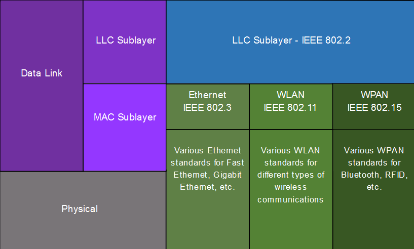
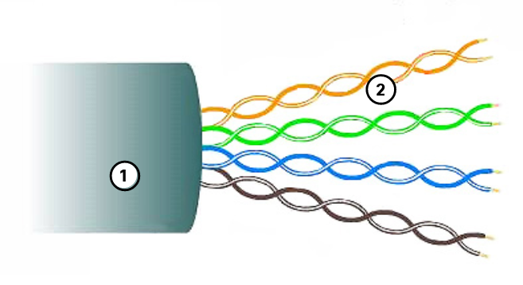
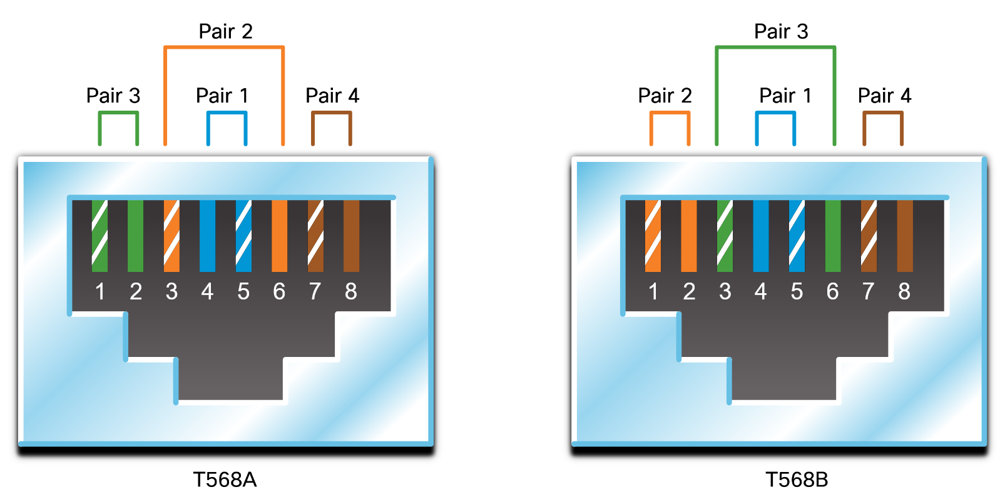
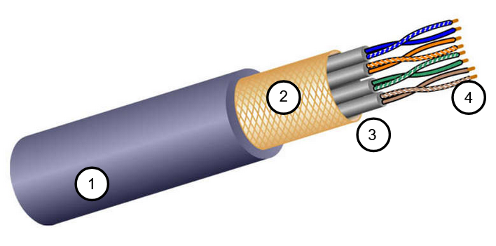
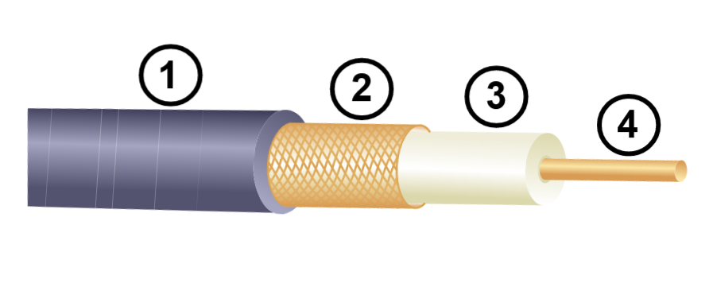
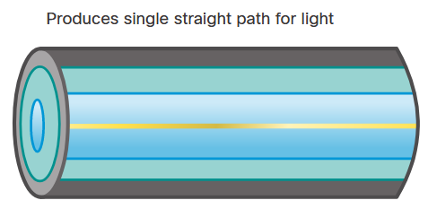
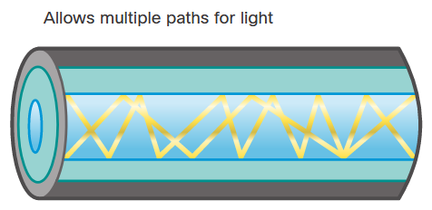
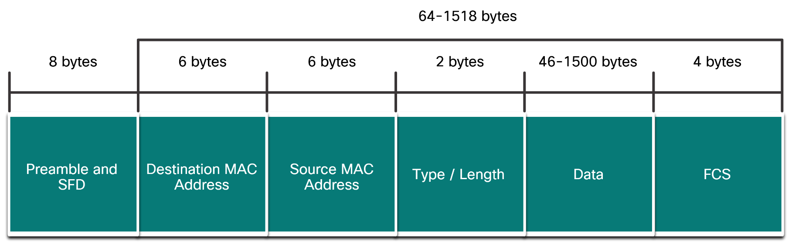

# 1 - Vrstva síťového přístupu, Ethernet
 - Protokol IEEE 802.3, MAC vrstva, IEEE 802.2, LLC vrstva, unicast, broadcast, multicast, anycast, ARP protokol, popis rámce Ethernet, PPP Média, modulace, šířka pásma, propustnost
 - Druhy médií - kabely, optická vlákna, bezdrátové sítě - základní principy činnosti
 - Značení kabelů a konektorů, kategorie kabelů, zapojení konektorů
 - Optická vlákna a konektory (SMF/MMF), základní princip činnosti

## 1. Vrstva síťového přístupu TCP/IP

V modelu OSI/ISO se dělí následovně

	

 - Spojová
   - LLC podvrstva
   - MAC podvrstva
 - Fyzická

Spojová a fyzická dohromady tvoří vrstvu síťového přístupu

### 1.1 Spojová vrstva
 - spojuje uzly v síti přes fyzickou vrstvu
 - rámce ve spojové vrstvě (PDU) nemohou překročit hranice místní sítě
 - provádí detekci chyb a odmítne jakýkoli poškozený rámec
 - definuje protokoly pro snížení a prevenci vzniku kolizí

#### 1.1.1 Logical Link Control (LLC)
 - přidává do rámce informaci o network layer protokolu
 - umožňuje, aby se v jedné síti mohlo používát několik síťových protokolů
   - IPv4, IPv6, AppleTalk
 - funguje jako rozhraní mezi síťovou vrstvou a MAC podvrstvou
 - IEEE 802.2

#### 1.1.2 Media Access Control (MAC)
 - je odpovědná za enkapsulaci dat a media access control
   - media access control určuje způsob přenosu dat přes nějaké médium (např. kabel)
 - přidává zdrojovou a cílovou MAC adresu do rámce
 - přidává trailer do rámce (pro detekci chyb)

##### 1.1.2.1 Access Control Methods
 - **CSMA/CD** - Carrier sense multiple access with collision detection
   - používá se v LAN sítích (drát)
 - **CSMA/CA** - Carrier sense multiple access with collision avoidance
   - používá se ve WLAN sítích (bezdrát)

### 1.2 Fyzická vrstva
 - fyzická vrstva poskytuje prostředky pro přenos bitů, které tvoří rámec spojové vrstvy, přes síťové médium
 - tato vrstva tedy přejímá rámec z vyšší vrstvy a kóduje ho jako sérií signálů
 - řeší tedy přenos dat přes konkrétní fyzické médium

## Typy komunikace
 - **Unicast**
   - data jsou určena jednomu hostiteli
 - **Broadcast**
   - v adrese "samé jedničky"
   - data jsou určena všem hostitelům v síti (LAN => nemůžeme zahltit globální síť)
 - **Multicast**
   - data jsou určena konkrétní skupině uživatelů
 - **Anycast**
   - data putují k nejbližšímu cíli s danou IP adresou
   - může být implementováno pouze v IPv6
   - při anycastu je tedy jedna IPv6 adresa přiřazena více zařízením v síti

## Druhy médií

### Měděné kabely
 - měděné kabely jsou dnes nejběžnějším typem připojení
 - existují 3 typy měděných kabelů, kde každý z nich je vhodnější pro použití v jiné situaci
 - signály EMI a RFI mohou zkreslovat a poškozovat datové signály přenášené měděnými kabely
   - Electromagnetic interference (EMI)
   - Radio frequency interference (RFI)

#### Unshielded twisted-pair (UTP)
 - **Konektor:** RJ-45
 - Nestíněná kroucená dvojlinka je nejběžnější síťové médium
 - Používá se k propojení koncových zařízení se síťovými zařízeními jako switche nebo routery
 - Skládá se ze 4 párů barevně označených vodičů
 - Tyto vodiče jsou obaleny plastovým pláštěm, který chrání před drobným poškozením
 - Zkroucení vodičů pomáhá chránit před rušením signálu z jiných vodičů

	

##### Types of UTP cables

	

<table>
	<thead>
		<tr>
			<th>Typ kabelu</th>
			<th>Standard</th>
			<th>Použití</th>
		</tr>
	</thead>
	<tbody>
		<tr>
			<td>Ethernet Straight-through</td>
			<td>Oba konce jsou buď T568A nebo T568B</td>
			<td>Připojuje hostitele ke switchi nebo switch k routeru</td>
		</tr>
		<tr>
			<td>Ethernet crossover</td>
			<td>Jeden konec je T568A a druhý je T568B</td>
			<td>Propojení podobných zařízení: host to host, switch to switch, router to router</td>
		</tr>
	</tbody>
</table>

 - Crossover kabely jsou dnes považovány za zastaralé
   - síťové karty používají křížení rozhraní závislé na médiu (auto-MDIX)
   - to detekuje typ kabelu a vytváří interní připojení

#### Shielded twisted-pair (STP)
 - **Konektor:** RJ-45
 - Stíněná kroucená dvojlinka poskytuje lepší ochranu proti rušení než UTP
 - Ve srovnání s UTP je však STP výrazně dražší

	

#### Coaxial cable
 - **Konektory:** BNC, N type, F type
 - Coaxial kabel, zkráceně coax má v sobě 2 vodiče
 - K přenosu signálů se používá vnitřní měděný vodič
 - Ten je obklopen vrstvou plastové izolace
 - V další vrstvě je izolační materiál s měděným opletením, který funguje jako druhý vodič a také jako stínění vnitřního vodiče
   - snižuje množství elektromagnetického rušení
 - Poslední vrstvou je vnější plášť, který brání proti fyzickému poškození
 - **Použití** (byl převážně nahrazen UTP)
   - připojení antén k bezdrátovým zařízením (přenos rádiového signálu)

	

#### Kategorie kabelů

<table>
	<thead>
		<tr>
			<th>Kategorie</th>
			<th>Přenosová rychlost</th>
			<th>Šířka pásma</th>
		</tr>
	</thead>
	<tbody>
		<tr>
			<td>Cat1</td>
			<td>1 Mb/s</td>
			<td>0,4 MHz</td>
		</tr>
		<tr>
			<td>Cat2</td>
			<td>4 Mb/s</td>
			<td>4 MHz</td>
		</tr>
		<tr>
			<td>Cat3</td>
			<td>10 Mb/s</td>
			<td>16 MHz</td>
		</tr>
		<tr>
			<td>Cat4</td>
			<td>16 Mb/s</td>
			<td>20 Mhz</td>
		</tr>
		<tr>
			<td>Cat5</td>
			<td>100 Mb/s</td>
			<td>100 Mhz</td>
		</tr>
		<tr>
			<td>Cat5e</td>
			<td>1 Gb/s</td>
			<td>100 Mhz</td>
		</tr>
		<tr>
			<td>Cat6</td>
			<td>10 Gb/s</td>
			<td>250 MHz</td>
		</tr>
		<tr>
			<td>Cat6a</td>
			<td>10 Gb/s</td>
			<td>500 MHz</td>
		</tr>
		<tr>
			<td>Cat7</td>
			<td>10 Gb/s</td>
			<td>600 MHz</td>
		</tr>
	</tbody>
</table>

### Optické připojení
 - Přenos dat na velké vzdálenosti
 - Velká šířka pásma
 - Optické kabely jsou zcela imunní vůči rušení (EMI i RFI)
 - Uvnitř optického kabelu se nachází vlákno z velmi čistého skla
 - Přenáší světlo (fotony)
 - Využívá se totálního odrazu

#### Typy optických médií
 - **Konektory:** ST, SC, LC
 - **Single-mode fiber (SMF)**

	

 - **Multimode fiber (MMF)**

	

### Porovnání UTP a optických kabelů

<table>
	<thead>
		<tr>
			<th>Vlatnost</th>
			<th>UTP kabely</th>
			<th>Optické kabely</th>
		</tr>
	</thead>
	<tbody>
		<tr>
			<td>Šířka pásma</td>
			<td>až 10 Gb/s</td>
			<td>až 100 Gb/s</td>
		</tr>
		<tr>
			<td>Vzdálenost</td>
			<td>až 100 metrů</td>
			<td>až 100 000 metrů</td>
		</tr>
		<tr>
			<td>Odolnost vůči rušení</td>
			<td>Nízká</td>
			<td>Vysoká (imunní)</td>
		</tr>
		<tr>
			<td>Cena</td>
			<td>Nízká</td>
			<td>Vysoká</td>
		</tr>
	</tbody>
</table>

### Bezdrátová připojení
 - Přenášejí elektromagnetické signály pomocí radiových frekvencí
 - Dnes už jeden z hlavních způsobů připojení k síti

#### Omezení bezdrátových sítí
 - **Oblast pokrytí**
   - fungují dobře v otevřeném prostředí
   - místní terén a překážky mohou omezit efektivní pokrytí
 - **Rušení**
   - náchylná k rušení
   - např. běžnými zařízeními (telefon, mikrovlnka, ...)
 - **Sdílené médium**
   - bezdrátové médium je sdíleno všemi uživateli
   - mnoho uživatelů přistupujících k síti WLAN má za následek snížení šířky pásma pro každého z nich

#### Standardy
 - **Wi-Fi (IEEE 802.11)**
 - **Bluetooth (IEEE 802.15)**
 - **Zigbee (IEEE 802.15.4)**
 - **WiMAX (IEEE 802.16)**

#### Bezdrátová média
 - **Wireless Access Point (AP)**
 - **Wireless NIC adapter**

## Šířka pásma
 - Šířka pásma je kapacita, na které může médium přenášet data
 - Šířka digitálního pásma měří množství dat, která mohou proudit z jednoho místa na druhé za daný čas
 - Udává se v Hz (frekvence)

Prakticky šířku pásma určuje kombinace několika faktorů:
 - Vlastnosti fyzického média
 - Zvolené technologie pro signalizaci a detekci signálů

### Terminologie měřící kvalitu šířky pásma

#### Latence (zpoždění)
= Latence označuje dobu, za kterou se data dostanou z jednoho bodu do druhého

V internetové síti stačí, aby jeden uzel na cestě k cíli měl menší propustnost a ovlivní to celkovou rychlost všech ostatních

#### Propustnost
 = Propustnost představuje množství bitů přenesených přes médium za daný časový úsek

Kvůli řadě faktorů obvykle propustnost neodpovídá šířce pásma. (Obvykle je nižší než šířka pásma)

## Address Resolution Protocol (ARP)
 - protokol pro odhalení IPv4 adres
 - hledá MAC adresu k dané IPv4 adrese
 - v IPv6 mu odpovídá ICMPv6 (ND - Neighbor Discovery)
 - Man in the middle (ARP spoofing)
 - **ARP Request**
   - MAC adresa není v ARP tabulce
   - pošle broadcast (FF-FF-FF-FF-FF-FF)
 - **ARP Reply**
   - odpověď zařízení s danou IPv4 adresou
   - po přijetí odpovědi se vytvoří záznam v tabulce

## Ethernet (IEEE 802.3)
 - Ethernet je rodina protokolů pro kabelové připojení 

### Rámec

	

Rámec musí mít délku alespoň 64 bytů. Pokud je paket menší, použijí se další bity (pad), které paket zvětší na tuto minimální velikost.

 - **Preambule**
   - slouží k synchronizaci mezi vysílacím a přijímacím zařízením
   - prvním několik bajtů v podstatě informuje zařízení, aby se připravilo na příjem nového rámce
 - **Cílová MAC adresa**
 - **Zdrojová MAC adresa**
 - **Typ**
   - identifikuje protokol vyšší vrstvy (IPv4, IPv6, ARP, ...)
 - **Data**
   - obsahuje zapouzřená data z vyšší vrstvy
 - **Kontrolní sekvence rámce (FCS)**
   - Detekce chyb v rámci
   - Používá cyclic redundancy check (CRC)
   - Chybné rámce jsou zahozeny

## Modulace signálu
= měníme charakter **nosného** signálu pomocí **modulačního** signálu
 
 1. **Analogové modulace**
    - dva signály s nekonečným počtem hodnot
	- výsledkem je znovu signál s nekonečným počtem hodnot
 2. **Digitalní modulace**
    - modulační signál nabývá konečného počtu stavů
	- ASK - amplitudová modulace
	- FSK - frekvenční modulace
	- PSK - fázová modulace 
