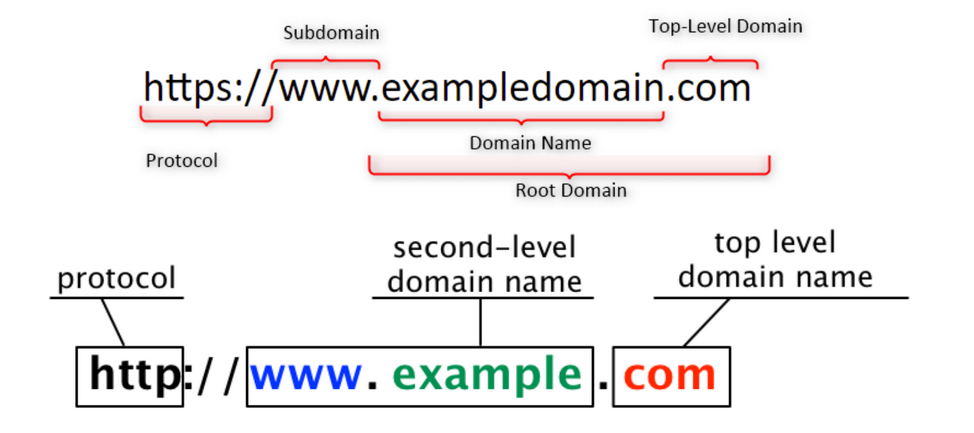

# 2 - Aplikační vrstva TCP/IP (DHCP, NAT, DNS)

 - Sítě P2P a klient-server (pro porovnání), aplikace P2P a klient-server (model)
 - WEB server, protokoly, porty, zabezpečení
 - email, protokoly, popis cesty od zdroje k cíli
 - komunikace s DHCP serverem, obsah zprávy DHCP serveru, DHCP Relay
 - Koncepce NAT, důvody a výhody použití NAT, port forwarding, druhy NAT
 - Doménové jméno FQDN, systém DNS - kořenové servery, TLD, SLD, autoritativní odpověď
 - FTP, SMB, NFS, telnet, TFTP, SSH, NTP

## Aplikační vrstva TCP/IP
 - Aplikační vrstva je nejblíže koncovému uživateli
 - Na aplikační vrstvu nám už přichází pouze **data**
 - Poskytuje nám protokoly pro různé aplikace
 - Tyto protokoly slouží k **výměně dat mezi programy** běžícími na zdrojovém a cílovém hostiteli

<table>
	<thead>
		<tr>
			<th>Číslo</th>
			<th>OSI Model</th>
			<th>PDU</th>
			<th>TCP/IP Protocol Suite</th>
			<th>TCP/IP Model</th>
		</tr>
	</thead>
	<tbody>
		<tr>
			<td>7</td>
			<td>Aplikační</td>
			<td rowspan="3">Data</td>
			<td rowspan="3">HTTP, DNS, DHCP, FTP</td>
			<td rowspan="3">Aplikační</td>
		</tr>
		<tr>
			<td>6</td>
			<td>Prezentační</td>
		</tr>
		<tr>
			<td>5</td>
			<td>Relační (Session)</td>
		</tr>
	</tbody>
</table>

### Prezentační vrstva
 - kódování
 - kryptování
 - komprese

### Relační vrstva (session)
 - navazuje, udržuje a synchronizuje session
 - obnovuje spojení i v případě fatálního výpadku (hardware)
 - když spojení nelze obnovit, tak session vrstva zajistí, že se nic nestalo
 - session tedy buď úspěšně přenese data nebo všechno zahodí, ale nic mezi tím

## Druhy aplikací

### Klient-server
 - klient zpravidla navazuje spojení
 - žádá nějaká data od serveru
 - na serveru jsou tedy uchovávána data
 - čím více uživatelů, tím pomalejší přístup (zatížení serveru)
 - přístup na **email**, **web**

### Peer-to-peer (P2P)
 - síť, ve které spolu komunikují přímo jednotliví klienti
 - bez použití dedikovaného serveru
 - každé připojené zařízení se chová jako klient i server
 - oproti klient-server se méně přetěžuje, méně náchylná vůči výpadkům
 - **kryptoměny**, **torrenty**

## WEB protokoly

### HTTP
 - Hypertext Transfer Protocol
 - **port 80**
 - **nešifrovaný**
 - slouží pro přenos hypertextových dokumentů (HTML, XML, ...) 
 - díky **MIME** se dají přenášet i jiné formáty
 - funguje způsobem **request/response** (dotaz, odpověď)

#### HTTP dotazovací metody
 - **GET** - vrací data
 - **POST** - posílá data na server
 - **PUT** - mění existující data na serveru
 - **DELETE** - maže data na serveru

#### HTTP response status codes 
 - **1xx** - informational - část dotazu byla obdržena a proces pokračuje
 - **2xx** - success
 - **3xx** - redirection
 - **4xx** - client error
 - **5xx** - server error

### HTTPS
 - HTTP Secure
 - **port 443**
 - **šifrovaný**
 - využívá protokol HTTP spolu s **SSL** nebo **TLS** (Diffie-Hellman)
 - oproti HTTP
   - nepatrný pokles výkonu
   - potřeba certifikátu 

## Mail protokoly 

 - zajišťují přenos elektronické pošty z jednoho zařízení na druhé

### SMTP
 - Simple Mail Transfer Protocol
 - **port 25** (pro komunikaci mezi mail servery)
 - **port 587** (pro odeslání emailu klientem na server)
 - **odesílání emailů**
 
#### Komunikace

 1. klient naváže TCP spojení s SMTP serverem
 2. pošle email
    - zkontroluje se zda se může poslat přímo
    - pokud ne → najde se příjemcova adresa za pomoci DNS

### POP3
 - Post Office Protocol
 - **port 110**
 - **stažení emailů**
 - **nesynchronizuje složky** (stahuje jenom inbox)
 - nevyžaduje stálé připojení
 - když jedno zařízení stáhne email, tak se smaže ze serveru
   - dá se nastavit, že nechá kopii pro další zařízení

#### Výhody/nevýhody

Vhodný pro **použití s jedním zařízením**.

 - \+ lze zobrazit email bez internetového připojení (stahuje je do lokálního úložiště)
 - \+ šetří místo na serveru (emaily se mažou)
 - \- je potřebná záloha pro případ ztráty nebo poničení zařízení

### IMAP
 - Internet Message Access Protocol
 - **port 143**
 - **stažení emailů**
 - také **synchronizuje všechny složky** (i custom vytvořené)
 - umožňuje synchronizaci elektronické schránky na více zařízeních
 - server u sebe uchovává aktuální verzi schránky

#### Výhody/nevýhody

Vhodný pro **použití s více zařízeními**.

 - \+ veškeré emaily jsou uloženy na serveru (všechny složky)
 - \+ všechny emaily a složky jsou synchronizovány
 - \- email nelze zobrazit bez internetového připojení (ukládá emaily pouze do cache)

## Sdílení souborů

### FTP
 - File Transfer Protocol
 - **port 20 a 21**
 - **není šifrovaný**
 - **používá TCP** (zaručuje doručení souborů)
 - standartní protokol pro přenos souborů v síti
 - pro přístup k FTP serveru → prohlížeč, FTP client (Total Commander)
 - **šifrované verze**
   - **SFTP** - FTP přes SSH (port 22)
   - **FTPS** - FTP přes SSL

### TFTP
 - Trivial FTP
 - **port 69**
 - používá se hlavně k přenosu souborů v lokální síti
 - **používá UDP** pro přenos (není spolehlivý)
 - maximální velikost přenášeného souboru je 32 MB
 - obvykle se používá pro stažení firmware nebo konfiguračních informací (síťová zařízení)

### NFS
 - Network File System
 - **port 111 a 2049**
 - **vzdálený přístup k souborům** 
 - používá se s Linuxovými systémy
 - funguje jak s **TCP** tak s **UDP**
 - v praxi můžete prostřednictvím NFS klienta připojit disk vzdálenémo serveru a pracovat s ním jako s lokálním

### SMB
 - Server Message Block
 - **port 139 a 445**
 - **vzdálený přístup k souborům** 
 - používá se s Windows systémy

### Samba
 - open-source reimplementace SMB
 - slouží pro sdílení souborů mezi mezi **Windows** a **Unix** systémy

## Připojení ke vzdálenému počítači pomocí CLI

### Telnet
 - Teletype network
 - **port 23**
 - připojení k vzdálenému počítači pomocí textového uživatelského rozhraní (CLI)
   - **CLI** - Command Line Interface
 - **nešifrovaná komunikace**
 - používá **TCP**

### SSH
 - Secure shell
 - **port 22**
 - připojení k vzdálenému počítači pomocí CLI
 - **šifrovaná komunikace**
 - náhrada za Telnet
   - občas i tak musíme telnet použít, když server nepodporuje novější protokoly

## DHCP, NAT, DNS

### DHCP
 - Dynamic Host Configuration Protocol
 - **port 67 a 68**
 - funguje přes **UDP**
 - zjednodušuje konfiguraci sítě
 - přiřazuje vhodné IP adresy koncovým zařízením
 - adresy se tedy nemusí přiřazovat ručně
 - adresy jsou však pouze **zapůjčeny** na nějakou dobu
   - klient musí před uplynutí doby zapůjčení IP adresu obnovit
     - DHCPREQUEST - zažádá o obnovení
	 - DHCPACK - server potvrdí obnovení 
   - tím je zajištěno, aby nevymizeli všechny adresy k zapůjčení

#### Když se chce klient připojit do sítě
 - **DHCP Discover** - broadcast od DHCP klienta (hledá DHCP server)
 - **DHCP Offer** - odpověď DHCP serveru
 - **DHCP Request** - žádost klienta o přiřazení IP adresy
 - **DHCP Acknowledge** - odpověď serveru, že přijal Request → zašle klientovy IP adresu

#### DHCP Relay agent
 - používá se v situaci, kdy existují dvě nebo více sítí oddělené routerem, ale jen jedna obsahuje DHCP server
 - na routeru se poté zapne relay agent
 - ten se nastaví tak, aby broadcast DHCP dotazy ze sítí bez DHCP serveru přeposílal na DHCP server

### NAT
 - Network Address Translation
 - překládá IP adresy
 - když začalo ubývat IPv4 adres, tak vznikly IPv6 adresy
 - přechod na IPv6 adresy však pořád trvá
   - proto kvůli zvětšení počtu IP adres vznikla NAT
 - adresy byli rozděleny na **soukromé** a **veřejné** (private, public)

<table>
	<thead>
		<tr>
			<th>Výhody</th>
			<th>Nevýhody</th>
		</tr>
	</thead>
	<tbody>
		<tr>
			<td>Šetří veřejné IP adresy (PAT)</td>
			<td>Způsobuje zpoždění v cestě</td>
		</tr>
		<tr>
			<td>Snadné vytváření vnitřních sítí (bez ohledu na veřejné IP adresy)</td>
			<td></td>
		</tr>
		<tr>
			<td>Skrývá adresy strojů před světem (vnitřní strukturu sítě)</td>
			<td></td>
		</tr>
		<tr>
			<td>Veřejnou adresu lze kdykoli libovolně měnit → nemá vliv na vnitřní síť</td>
			<td></td>
		</tr>
	</tbody>
</table>

#### Druhy adres v NAT

<table>
	<thead>
		<tr>
			<th>Inside local</th>
			<th>Inside global</th>
			<th>Outside local</th>
			<th>Outside global</th>
		</tr>
	</thead>
	<tbody>
		<tr>
			<td>privátní adresa hostitele</td>
			<td>veřejná adresa hostitele</td>
			<td>veřejná adresa např. serveru</td>
			<td>veřejná adresa např. serveru</td>
		</tr>
	</tbody>
</table>

#### Druhy NAT
 - **Statická NAT**
   - 1:1 (1 public na 1 private)
   - umožňuje navázání spojení z venku
   - ruční nastavení dvojic soukromé a veřejné IP adresy
 - **Dynamická NAT** (Maškaráda)
   - 1:1 (1 public na 1 private)
   - oproti statické NAT přiřazuje adresy automaticky
   - je však potřeba mít dostatek veřejných adres
 - **PAT** (Port Adress Translation)
   - 1:N (1 public na N private)
   - Pod pojmem NAT dnes většinou myslíme PAT
   - Překládá soukromé adresy na jedinou veřejnou adresu pomocí čísel portů
   - **číslo portu zůstává stejné** jen se změní soukromá adresa na veřejnou

#### Port forwarding
 - port forwarding **zpřístupňuje služby hostitele v NATované síti (PAT)**
 - používá se, když potřebujeme např. vzdálený přístup k počítačí za NAT
 - pošleme náš packet s číslem portu **3389** na IP routeru
 - router neví co má s packetem dál dělat, takže mu nastavíme, že všechny packety s číslem portu **3389** bude posílat na **PC1**
 - tím umožníme vzdálený plochu pro **PC1**
 - **PC1** nemá sám o sobě veřejnou IP adresu, takže k němu nemůžeme přistupovat přímo

### DNS
 - Domain Name Server
 - **port 53**
 - překládá lidsky čitelná doménová jména (www.google.com) na IP adresy
 - dal by se přirovnat k telefonnímu seznamu (podle jména hledáme číslo)
 - **kořenový server** = první server, na který se pošle DNS lookup
 - **autoritativní odpověď** = odpověď přímo od serveru, který má na starosti dotazované doménové jméno

#### FQDN
 - Fully Qualified Domain Name
 - plně specifikované doménové jméno
 - www.google.com
   - www - jméno hostitele
   - google - second-level doména (SLD)
   - .com - top-level doména (TLD)
   - google.com - doménové jméno
 
 

 	
 

### NTP
 - Network Time Protocol
 - **port 23** (UDP)
 - zajišťuje synchronizaci vnitřních hodin počítačů
