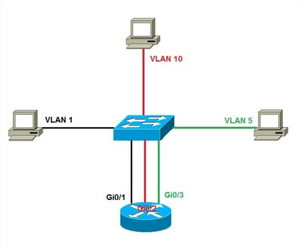
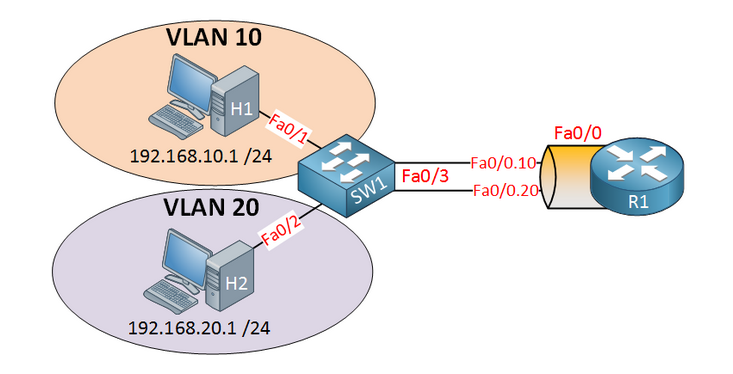
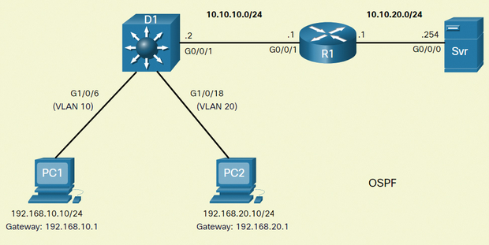

# 5 - VLAN, Inter-VLAN, návrh podnikové sítě

 - Koncepce VLAN, výhody nasazení VLAN, access VLAN, trunk VLAN, IEEE802.1Q, native VLAN, management VLAN, voice VLAN
 - Tři způsoby propojení VLAN, porovnání metod z hlediska efektivity
 - Nastavení routeru pro propojení VLAN (legacy, router-on-stick)
 - Nastavení L3 switche pro Inter-VLAN, možnost směrování L3 switche
 - Návrh podnikové sítě s např. 6 sekcemi - VLAN, podsíťování, propojování VLAN

## Koncepce a výhody VLAN

### Koncepce VLAN
 - **logické rozdělení sítě** (fyzicky se nic nemění)
 - VLAN → virtuální skupiny
 - unicast, multicast a broadcast je posílán jen strojům s danou VLAN
 - můžeme oddělit například oddělení ve firmě
   - IT, Sales, ...

### Výhody VLAN
 - **Zmenšení broadcastové domény**
   - což vede ke **zlepšení výkonu**
 - **Zlepšení zabezpečení**
   - mohou spolu komunikovat jen zařízení ve stejné VLAN
     - **izolace zařízení**
   - můžeme na routeru nastavit ACL pro omezení komunikace mezi jednotlivými VLAN
 - **Zmenšení nákladů**
   - místo koupení **3 switchů** uděláme na jednom switchi **3 VLANy**
 - **Zjednodušuje správu sítě**

## Stav portů
 - porty na switchi mohou být v jednom z těchto dvou módů

### Access
 - určen pro **připojení koncových zařízení**
 - na port přichází pouze data od přiřazené VLAN
 - data, které na port od zařízení jsou taggovaná číslem dané VLAN

### Trunk
 - používá se, když potřebujeme přenášet data:
   - mezi dvěma switchi
   - mezi routerem a switchem
 - umožňuje přenos rámců z **více různých VLAN**

## Druhy VLAN

### Default VLAN
 - na cisco zařízeních **VLAN 1**
 - defaultně jsou všechny porty ve **VLAN 1** (mode access)
 - VLAN 1 je také defaultně:
   - native VLAN
   - management VLAN
 - VLAN 1 nelze přejmenovat nebo smazat

### Native VLAN
 - **netaggovaná**
 - packety bez tagu, co přijdou do trunk portu, jsou přesměrovány na native VLAN
 - útok typu **VLAN hopping**

### Management VLAN
 - normální VLAN
 - speciálně nakonfigurovaná pro správu sítě
   - SSH, Telnet, HTTP, ...

### Voice VLAN
 - podporuje Voice over IP (VoIP)
 - přenos přes tuto VLAN je prioritní

## IEEE 802.1Q
 - protokol, který přidává do Ethernetových rámců podporu VLAN
 - umožňuje tzv. **VLAN tagging**
 - rámec tedy v sobě uchovává informaci o VLAN ID

## Inter-VLAN routing

### Legacy
 - **každá VLAN má svůj port na routeru**
 - ten je použit jako gateway
 - cena roste s každou VLAN

<div align="center">
	
</div>

### Router-on-stick
 - využit jeden interface na routeru
 - **každá VLAN má svůj subinterface**
 - čísla subinterface nemají speciální význam (nejsou závislé na čísle VLAN)
 - router je spojen se switchem pomocí jednoho kabelu
   - ten je nakonfigurován jako **trunk**
 - router musí podporovat standard **IEEE 802.1Q**

<div align="center">
	
</div>

### Multilayer switch
 - **pro každou VLAN je vytvořeno SVI** (Switch Virtual Interface)
 - každé SVI má jinou IP adresu a slouží jako default gateway pro svojí VLAN

```
L3(config)# interface vlan 10 // Vytvoří SVI
L3(config-if)# ip address 192.168.10.1 255.255.255.0 // adresa pro SVI
L3(config-if)# no shutdown
```

<div align="center">
	
</div>

## Nastavení routeru pro propojení VLAN

### Legacy
 1. vytvoření VLAN
 2. přepnutí portů do access-mode
 3. přiřazení VLAN jednotlivým rozhraním (portům)
 4. na routeru nastavit IP adresy (gateway) pro každou VLAN

### Router-on-stick
 1. vytvoření VLAN
 2. přepnutí portu do access-mode
 3. přiřazení VLAN jednotlivým rozhraním (portům)
 4. jeden port nastavit jako trunk a povolit VLAN co chceme
 5. na routeru vytvořit subinterface pro každou VLAN a nastavit IP adresy

## Nastavení L3 switche pro propojení VLAN
 1. vytvoření VLAN
 2. přepnutí portu do access-mode
 3. přiřazení VLAN jednotlivým rozhraním (portům)
 4. vytvoření SVI pro každou VLAN
 5. nastavit IP adresy pro SVI

## Možnost směrování L3 switche
 - příkaz `no switchport` ze **switch portu** udělá **router interface**
 - každý port se tak může chovat jako switch nebo router
