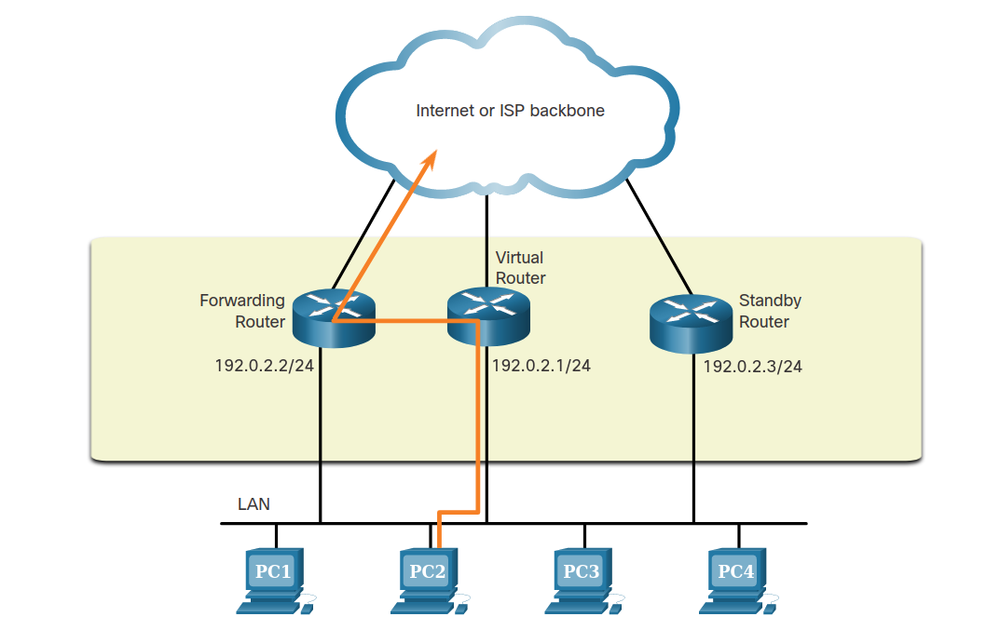

# 6 - Spolehlivá síť - STP, Etherchannel, FHRP

 - Problém vytváření záložních cest, redundantní sítě
 - Redundance na vrstvě L2, protokol STP (druhy), smyčky, broadcastová bouře, STA, priorita, výpočet 
 - Agregace linky, Etherchannel, protokoly, výhody, konfigurace (switch cisco)
 - Virtuální výchozí brána, redundance směrovače, protokoly, nastavení FHRP (router cisco)

## Problém vytváření záložních cest
 - Více cest na L2 → smyčky → STP
 - Více cest na L3 → použijeme routy
 - Více default gateway → FHRP

## Redundantní sítě

## STP
 - Spanning Tree Protocol
 - detekuje **redundantní cesty**
 - zabraňuje vzniku smyček **blokováním portů**
 - **smyčka** = zapojení switchů tvoří dohromady kruh
 - zajišťuje redundanci v případě poruchy

### Druhy STP
 - **STP**
   - základní
   - změna topologie trvá 50 sekund
 - **RSTP**
   - Rapid STP
   - vylepšené STP
 - **PVST+**
   - Per-VLAN Spanning Tree
   - lze definovat v každé VLAN

### Broadcastová bouře
 - abnormálně velký počet broadcastů, který může přetížit celou síť
 - může vzniknout v případě smyčky na L2

### STA
 - Spanning Tree Algorithm
 - grafový algoritmus, který hledá **minimální kostru grafu**
   - funguje v ohodnoceném grafu
 - **minimální kostra grafu**
   - počet vrcholů = V
   - počet hran = V - 1
 - hodnoty (váhy) jednotlivých hran v grafu odpovídají rychlosti portů
   - čím vyšší rychlost, tím menší váha

#### Jak funguje v sítích?
 - Zvolí se **root bridge** na základě bridge ID
 - **Bridge ID**
   - **priority** - default hodnota je 32768 + číslo VLAN (1) = **32769**
   - **MAC adresy**
 - volí se na základě priority a když jsou stejné, tak se zvolí jako root ten s nižší MAC adresou
 - switche spolu komunikují pomocí **BPDU** rámců
 - u root bridge jsou všechny porty **designated**
 - ostatní switche si zvolí cestu s nejnižší cenou a dané porty se stanou **root porty**
   - směřují k root bridži
 - naproti root portu je vždycky designated
 - tam kde není žadný root port, tak se na základě bridge ID zvolí designated port
 - ostatní porty budou **alternate** (blokovány)

## Etherchannel
 - agregovaná linka
 - spojení více fyzických rozhraní do jednoho virtuálního - **port channel**
 - je tak vytvořeno jedno logické spojení
 - zvyšuje propustnost (šířku pásma)
 - **podmínky pro použití**
   - stejný duplex (full, half)
   - stejná rychlost (Fa, Gig)
   - stejná VLAN

### Výhody
 - nemusíme upgradovat na lepší zařízení pro zvýšení propustnosti
 - STP neblokuje ostatní cesty, protože Etherchannel vidí jako jedno spojení

### Protokoly
 - **Link Aggregation Control Protocol (LACP)**
   - mód
     - active
	 - passive
 - **Port Aggregation Protocol (PAgP)**
   - cisco proprietární
     - auto
	 - desirable

## FHRP
 - First Hop Redundancy Protocol
 - vytvoří virtuální router
 - když v sítí selže brána (router) nemůžeme komunikovat se světem
 - proto máme virtuální bránu
 - na pozadí je víc routerů
 - stav routeru
   - **forwarding**
   - **standby**

	

### Druhy FHRP
 - **HSRP**
   - cisco proprietární
 - **VRRP**
 - **GLBP**
   - cisco proprietární
   - umožňuje balancovat provoz mezi více routery
   - zvyšuje propustnost
