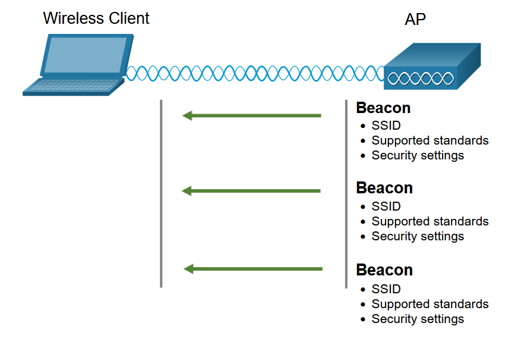

# 7 - Sítě standardu IEEE 802.11
 - Přenosová trasa, přístup k médiu, IEEE 802.11/a/b/g/n/ac/ad/ax
 - AFHSS, DSSS, OFDM, QAM, MIMO, šířka pásma, kanály, přenosová rychlost
 - Beamforming, RU, BSS Coloring, TWT, MU-MIMO, OFDMA
 - AD-hoc, Wi-Fi Direct, infrastrukturní sítě, BSS, ESD, ESSID, MAC control
 - Zabezpečení WLAN - WEP, WPA, WPA2, WPA3, AAA, EAP, 802.1X, Radius

## Bezdrátová připojení
 - Přenášejí elektromagnetické signály pomocí rádiových frekvencí
 - Dnes už jeden z hlavních způsobů připojení k síti

### Omezení bezdrátových sítí
 - **Oblast pokrytí**
   - fungují dobře v otevřeném prostředí
   - místní terén a překážky mohou omezit efektivní pokrytí
 - **Rušení**
   - náchylná k rušení
   - např. běžnými zařízeními (telefon, mikrovlnka, ...)
 - **Sdílené médium**
   - bezdrátové médium je sdíleno všemi uživateli
   - mnoho uživatelů přistupujících k síti WLAN má za následek snížení šířky pásma pro každého z nich

### Bezdrátová média
 - **Wireless Access Point (AP)**
 - **Wireless NIC adapter**

## Typy bezdrátových sítí
 - **WPAN**
   - používá vysílače s nízkým výkonem pro síť s krátkým dosahem (6 - 9 metrů)
   - Bluetooth, ZigBee, Z-Wave (proprietární)
 - **WLAN**
   - používá vysílače pro pokrytí středně velké sítě
   - použití v domácnostech, kancelářích
 - **WMAN**
   - specifické licencované frekvence
   - mobilní sítě
 - **WWAN**
   - specifické licencované frekvence
   - národní a globální komunikace
   - satelity

## IEEE 802.11 standardy

<table>
	<thead>
		<tr>
			<th>Generace</th>
			<th>IEEE WLAN standard</th>
			<th>Radiová frekvence</th>
			<th>Popis</th>
		</tr>
	</thead>
	<tbody>
		<tr>
			<th></th>
			<td>802.11</td>
			<td>2.4 GHz</td>
			<td>Rychlosti do <strong>2 Mb/s</strong></td>
		</tr>
		<tr>
			<th></th>
			<td>802.11a</td>
			<td>5 GHz</td>
			<td>
				Rychlosti do <strong>54 Mb/s</strong>  
				Malá oblash pokrytí  
				Menší účinnost při pronikání budovami  
			</td>
		</tr>
		<tr>
			<th></th>
			<td>802.11b</td>
			<td>2.4 GHz</td>
			<td>
				Rychlosti do <strong>11 Mb/s</strong>  
				Delší dosah a průnik budovami než 802.11a
			</td>
		</tr>
		<tr>
			<th></th>
			<td>802.11g</td>
			<td>2.4 GHz</td>
			<td>
				Rychlosti do <strong>54 Mb/s</strong>  
				Zpětná kompatibilita se standardem 802.11b
			</td>
		</tr>
		<tr>
			<th>Wi-Fi 4</th>
			<td>802.11n</td>
			<td>2.4 a 5 GHz</td>
			<td>
				Rychlosti od <strong>150 Mb/s</strong> do <strong>600 Mb/s</strong>  
				Dosah až 70 m  
				AP a klienti vyžadují více antén pomocí MIMO  
			</td>
		</tr>
		<tr>
			<th>Wi-Fi 5</th>
			<td>802.11ac</td>
			<td>5 GHz</td>
			<td>
				Rychlosti od <strong>450 Mb/s</strong> do <strong>1,3 Gb/s</strong>  
				Podpora až <strong>8 antén</strong>  
				Zpětná kompatibilita s 802.11a/n  
			</td>
		</tr>
		<tr>
			<th>Wi-Fi 6</th>
			<td>802.11ax</td>
			<td>2.4 a 5 GHz</td>
			<td>
				Rychlosti od <strong>574 Mb/s</strong> do <strong>9,6 Gb/s</strong>  
				<strong>BSS</strong> a <strong>WPA3</strong></strong>  
			</td>
		</tr>
	</tbody>
</table>

 - Wi-Fi 6E je také založena na standardu 802.11ax a přidává podporu pro frekvenci 6GHz

## Rádiové frekvence
 - Všechna bezdrátová zařízení pracují v oblasti rádiových vln elektromagnetického spektra

Sítím WLAN jsou přidělen následující frekvenční pásma:

 1. 2.4 GHz (UHF) - 802.11/b/g/b/ax
 2. 5 GHz (SHF) - 802.11a/n/ac/ax

### Elektromagnetické spektrum

## Access Point (AP)
 - převádí protokol **IEEE 802.11** na **802.3**

Existují dva druhy AP:

 1. **Autonomní AP**
    - používají se, když potřebujeme pouze pár AP
	- vyžadují nezávislou konfiguraci
	- např. Home Router
 2. **Controller-based AP** (CAP)
    - když potřebujeme mnoho AP
	- LAP - Lightweight AP
	- ke komunikace s řadičem WLC používají LWAPP protokol
	- pomocí řadiče se konfigurují jednotlivá AP

## Antény
 - **Všesměrová anténa** (Omnidirectional)
   - 360 stupňové pokrytí
   - ideální v domech, otevřených kancelářích, konferenčích místnostech a venkovních prostorách
 - **Směrová anténa** (Directional)
   - zaměřuje signál v daném směru
   - signál je silný pouze v tomto jedno směru
   - např. **Yagi** a **parabola**
 - **MIMO antény**
   - využívá více antén ke zvýšení **šířky pásma**
   - lze použít až 8 vysílacích a 8 přijímacích antén
   - využívá se u 802.11n/ac/ax

## 802.11 Režimy bezdrátové topologie

### Ad hoc
 - bezdrátové připojení dvou zařízení způsobem **peer-to-peer** (P2P)
 - příkladem jsou bezdrátoví klienti, kteří k sobě přistupují pomocí **Bluetooth**
 - označuje se jako **IBSS** - independent basic service set

### Infrastructure mode
 - v tomto režimu se bezdrátoví klienti propojují prostřednictvím **wireless routeru** nebo **access pointu (AP)**
 - AP se připojují pomocí kabelového distribučního systému např. **Ethernet**

### Tethering
 - varianta topologie **ad hoc**
 - vytvoření osobního hotspotu pomocí telefonu nebo tabletu
 - ostatní zařízení poté pomocí P2P připojení získají přístup k internetu

## BSS a ESS
 - **Basic Service Set (BSS)**
   - skládá se z jednoho AP, který propojuje všechny bezdrátové klienty
   - klienti mohou mezi sebou komunikovat jen v rámci **Basic Service Area (BSA)**
   - k jednoznačné identifikaci AP se používá MAC adresa - **Basec Service Set Identifier (BSSID)**
   - **BSSID** je vždy spojen pouze s jedním AP

	

 - **Extended Service Set (ESS)**
   - ESS je spojení více BSS prostřednictvím distribučního systému
   - ESS je identifikován **SSID** a každý BSS je identifikován **BSSID**
   - V rámci jedné ESS tak spolu můžou komunikovat bezdrátoví klienti z různých BSA

	

## Passive and Active discover mode

### Passive

	

### Active

	

## Šířka pásma
 - Šířka pásma je obecně množství dat, které mohou proudit přes médium za daný čas
 - V bezdrátových sítích je to **rozsah frekvencí**, které jsou k dispozici pro přenos signálu
 - Větší šířka pásma znamená větší přenosovou rychlost a větší kapacitu pro přenos dat

	

## Kanály
 - jsou určené pro rozdělení šířky pásma na menší kousky
 - ty jsou použity pro komunikaci mezi zařízeními
 - pokud je poptávka po určitém kanálu příliš vysoká, může dojít k jeho přesycení

### Nasycení frekvenčního kanálu

Byla vytvořena řada technik pro zlepšení bezdrátové komunikace a zmírnění nasycení.

 - **Direct Sequence Spread Spectrum (DSSS)**
   - modulační technika určená k **rozprostření signálu** ve větším frekvenčním pásmu
   - správně nakonfigurovaný přijímač dokáže modulaci DSSS obrátit a zrekonstruovat původní signál
   - modulaci používají zařízení v **802.11b**, aby se vyhnula rušení

	

 - **Frequency-Hopping Spread Spectrum (FHSS)**
   - probíhá pomocí metod rozprostřeného spektra
   - přenáší radiové signály **přepínáním** nosného signálu **mezi mnoha frekvenčními kanály**
   - odesílatel i přijímač musí být synchronizováni (aby věděli na který kanál mají přejít)
   - tento proces přeskakování umožňuje efektivnější využití kanálů a snižuje jejich přetížení
   - FHSS byl použit u standardu **802.11**
   - používají ho také **vysílačky** a **Bluetooth**

	

 - **Orthogonal Frequency-Division Multiplexing (OFDM)**
   - jedná se o podmnožinu multiplexování kmitočtovým dělením, kdy jeden kanál využívá více dílčích kanálů na sousedních frekvencích
   - dílčí kanály jsou vůči sobě přesně ortogonální, což umožňuje, aby se dílčí kanály překrývaly bez vzájemného rušení
   - používá se v **802.11a/g/n/ac**
   - nový systém **802.11ax** používá variantu OFDM - **OFDMA**

	

