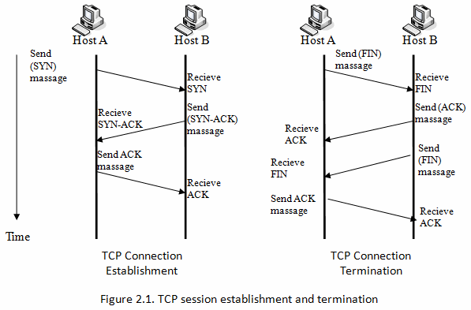
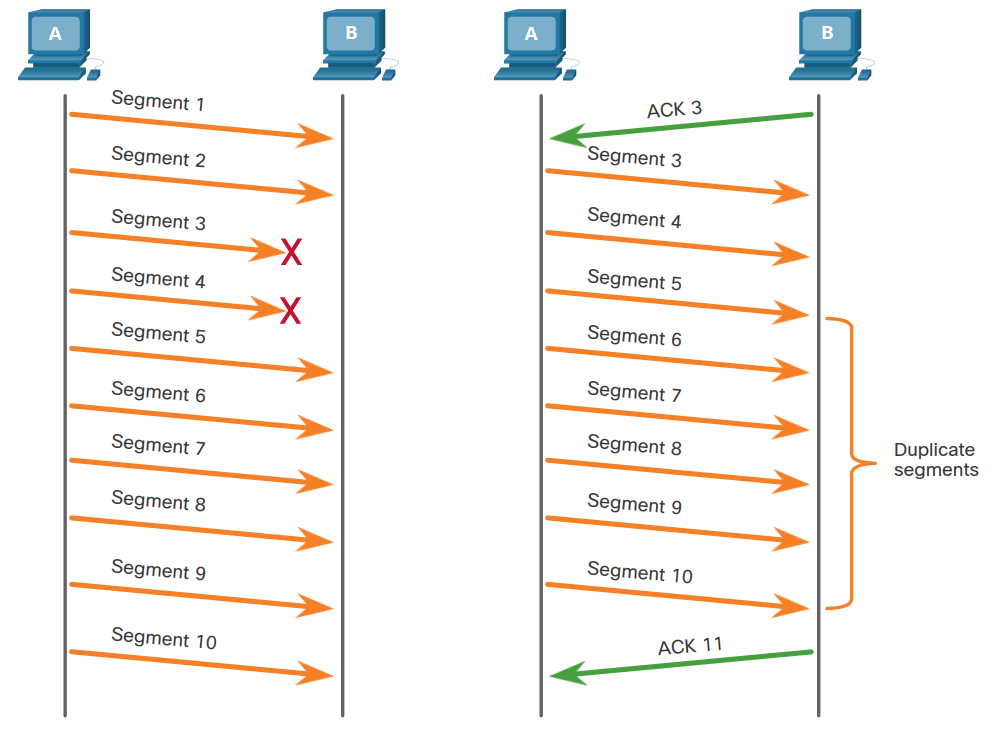
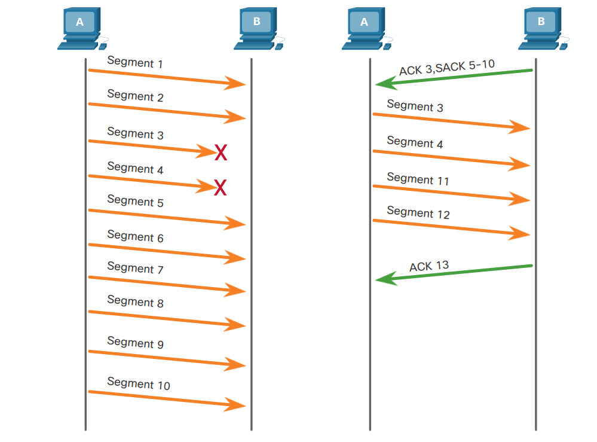
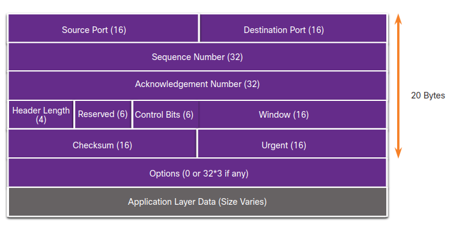
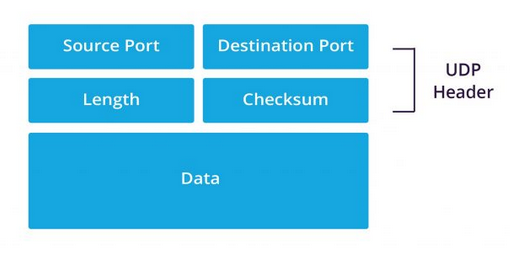

# 8 - Protokol TCP, UDP
 - Přepínání datagramů vs. přepínání obvodů, TCP komunikace, segmentace, multiplexování segmentů
 - formát datagramu, řízení toku, omezení režie, navázání a ukončení spojení (3 a 4 cestný handshake), plovoucí okno
 - porovnání komunikace s použitím TCP a UDP, čísla portů, příklady

## Transportní vrstva
 - přidává do PDU **čísla portu**
 - rozděluje data na **segmenty** (TCP)
 - **multiplexování segmentů**
 - zajišťuje výměnu dat mezi aplikacemi z vrstvy L7

## TCP
 - Transmission Control Protocol
 - zaručuje **spolehlivé doručení dat**
 - **navazuje spojení** (3 cestný handshake)
 - **ukončuje spojení** (4 cestný handshake)

	

### Spolehlivé doručení
 - **segmentace**
   - rozdělení dat na segmenty
   - segmenty jsou očíslovány (sequence number)
   - příjemce si poté může sestavit data do původní podoby
 - příjemce potvrzuje přijaté segmenty (ACK)
 - při **ztrátě dat (segmentů)** → se pošlou znovu (obrázek)

#### Ztráta dat

	

#### SACK
 - pokud obě strany podporují SACK (selective ACK) 

	

### Flow control
 - řízení toku dat
 - používá se, **aby nedošlo k zahlcení přijímací strany**
 - **window size**
   - počet bytů, které můžeme poslat než musíme čekat na potvrzení (ACK) od příjemce
   - je to informace, kterou dává příjemce odesílateli před zahájením komunikace
 - **MSS (Maximum Segment Size)**
   - je součástí options pole v TCP hlavičce
   - určuje největší množství dat v bajtech, které může příjemce přijmout v jednom TCP segmentu
   - obvyklá hodnota je 1460 bajtů
     - MSS = MTU - IP header - TCP header
	 - MSS = 1500 - 20 - 20 = **1460 bajtů**
 - **MTU (Maximum Transmission Unit)**

### Využití
 - všude, kde si nemůžeme dovolit ztratit žádná data
 - **HTTP**, **HTTPS**

### Segment

	

## UDP
 - User Datagram Protocol
 - zajišťuje **plynulé doručení dat**
 - je **connectionless** a **nespolehlivé**
   - nenavazuje spojení
   - neposílá znovu ztracená data
 - **low overhead**
   - malá hlavička
 - hlavička se skládá jen z čísel portů a CRC
 - podpora **multiplexování**
 - **best-effort**
   - neposílá žádný ACK
   - neinformuje tedy nijak o úspešném doručení dat příjemci

### Využití
 - aplikace, kde je důležitá **latence**
 - gaming
 - průmyslové sítě
 - streamovaná data (audio, video)
 - **DNS**, **VoIP**

### Datagram

	

## Porty
 - jsou v rozmezí od 0 do 216 (65536)
 - port TCP-16 a UDP-16 spolu nijak nesouvisí
   - na obou dvou může tedy probíhat komunikace nezávisle na sobě
 - **Well-known** (0-1023)
   - přiděleny nejpoužívanějším aplikacím
   - FTP, HTTP, DNS, DHCP, ...
 - **Registered** (1024-49151)
   - registruje je IANA
   - Quake, VPN, RDP
 - **Private, dynamic** (49152-65535)
   - většinou zdrojové porty klientů 
