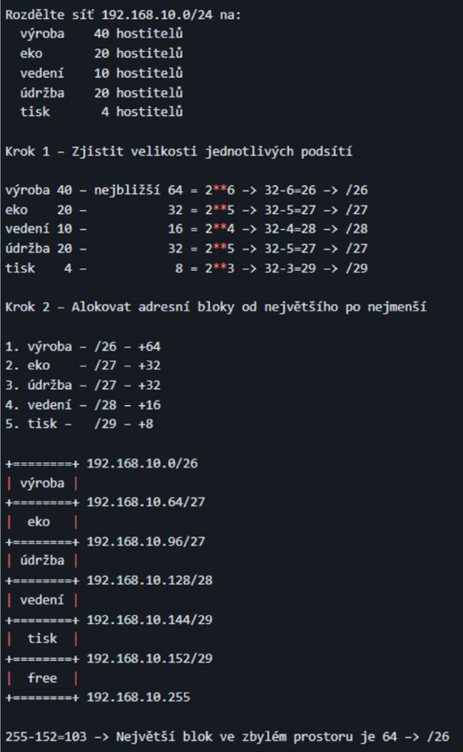

# 9 - Adresace v internetu, cesta datagramu sítí
 - Značení portů na aktivních propojovacích (př. CISCO), fyzické adresy (MAC)
 - Třídy adres IPv4, rezervované (speciální adresy), veřejné a privátní adresy
 - Vytváření podsítí (podsítě konstantní velikost, VLSM)
 - Porty (well-known, registered, private/dynamic), protokoly IP, ICMP, ARP
 - Cesta datagramu sítí, průchod dat přes switch, směrovač, NAT (zdrojové a cílové adresy) a firewall

## Značení portů na zařízeních CISCO
 - blok/module/interface (Gig 0/0/1)
 - **blok** - slot do kterého se zapojují moduly 
 - **module** - jedna síťová karta, která poskytuje víc interfaců (portů) stejného druhu (je vyměnitelný)
 - **interface** - port, do kterého zapojujeme kabel

## MAC adresy
 - Media Access Control
 - je přiřazena síťové kartě při výrobě
   - u dnešních karet se hodnota dá změnit
 - figuruje na **L2**
 - **48 bitů**
 - 6 skupin 2 hex čísel - 6 oktetů
   - 01-32-A5-87-B4-05

## IPv4 adresy
 - je přidělena zařízení, které komunikuje pomocí protokolu **IP** 
 - **32 bitů**
 - 4 oktety - 232 adres
 - skládá se z **čísla sítě**, **masky sítě** a **čísla hostitele**

### Veřejná / soukromá
 - **Soukromá adresa**
   - používá se v lokálních sítích
   - nedají se použít v internetu
   - 192.168.0.0/16
   - 10.0.0.0/8
   - 172.16.0.0/12
 - **Veřejná adresa**
   - používá se v rámci internetu

### Třídy adres
 - využítí hlavně když nebyla maska sítě
 - podle prvních bitů v adrese
 - **Třída A** (0)
   - nadnárodní a vládní organizace
 - **Třída B** (10)
   - významné organizace a školní instituce
 - **Třída C** (110)
   - dostupné i pro běžné smrtelníky
 - **Třída D** (1110, multicasting)
   -  224.0.0.0 až 239.255.255.255
 - **Třída E** (1111, experimentální účely)
   - 240.0.0.0 až 247.255.255.255
 
### Speciální adresy
 - 127.x.x.x - localhost

## Vytváření podsítí
 
### FLSM
 - Fixed-Length Subnet Mask
 - Všechny podsítě mají stejnou masku (jsou stejně velké)

Př.:

192.168.1.0/24 → chceme masku 26 
počet podsítí → 2(26-24) = 22 = **4** 
velikost podsítě → 2(32-26) = 26 = **64**

Vzniklé podsítě (4): 
192.168.1.0/26 
192.168.1.64/26 
192.168.1.128/26 
192.168.1.192/26 

### VLSM
 - Variable-Length Subnet Mask
 - podsítě jsou jinak velké 

## Porty
 - rozlišují aplikace na vrstvě L7
 - figurují na transportní vrstvě L4

### Čísla portů
 - jsou v rozmezí od 0 do 216 (65536)
 - port TCP-16 a UDP-16 spolu nijak nesouvisí
   - na obou dvou může tedy probíhat komunikace nezávisle na sobě
 - **Well-known** (0-1023)
   - přiděleny nejpoužívanějším aplikacím
   - FTP, HTTP, DNS, DHCP, ...
 - **Registered** (1024-49151)
   - registruje je IANA
   - Quake, VPN, RDP
 - **Private, dynamic** (49152-65535)
   - většinou zdrojové porty klientů 
   - pro soukromé využití
   - nejsou pevně přiděleny žádným aplikacím

### Socket
 - **IP adresa + číslo portu**
 - identifikuje server a službu požadovanou klientem

#### Příklad socketu

Klientův socket - 192.168.1.5:51234 (51234 - zdrojový port klienta) 
Socket webu - 192.168.1.7:80 (80 - HTTP, webový server) 
Socket pair je tudíž 192.168.1.5:51234, 192.168.1.7:80

## IP protokol
 - přenáší data na základě IP adres
 - funguje na vrstvě L3

## ICMP
 - Internet Control Message Protocol
 - poskytuje informace o síti
 - ping
 - tracert

## ARP
 - zjišťuje MAC adresu k dané IP adrese
 - ARP request
 - ARP reply

## Cesta datagramu sítí

### Průchod dat přes switch
 - CAM tabulka
 - pracuje s MAC adresami
   - přijde frame
   - koukne na cílovou adresu
   - když ji zná pošle to tam, jinak pošle všem

### Průchod dat přes router
 - Směrovací tabulka
   - přijde packet
   - zná cíl → odešle
   - nezná cíl (je default route) → odešle
   - nezná cíl (není defautl route) → zahodí

### Průchod dat přes NAT
 - funguje na routeru, router ukládá port a původní adresu
   - přijde datagram
   - NAT koukne na zdrojovou adresu a vymění ji za veřejnou (port zůstává)
   - když se datagram vrací, koukne na cílovou adresu a vymění ji za adresu z tabulky a odešle původnímu stroji
