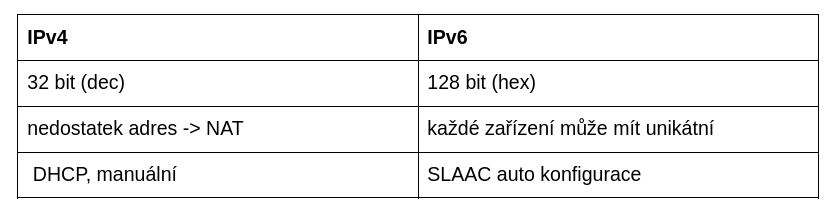
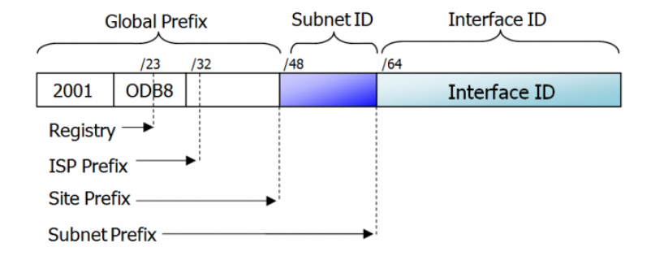
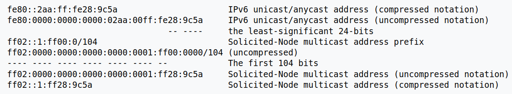

# 10 - Protokol IPv6, NDP
 - Specifikace, srovnání s IPv4, dual-stack, tunel, NAT64
 - skupiny adres a globální prefixy, kanonický zápis, komprimace nul
 - druhy vysílání (unicast, multicast, anycast), druhy adres IPv6 včetně příkladů
 - ICMPv6 (NDP), RS, RA, NS, NA, redirect, DAD
 - DHCPv6 server, příznakové bity A, O, M

## Specifikace
 - následník IPv4
 - adresa má 128 bitů
 - vrstva L3
 - 3 druhy adres
   - unicast
   - multicast
   - anycast
 - automatická konfigurace

## Srovnání IPv4 a IPv6

	

## Dual-stack
 - když má zařízení nastavenou IPv4 i IPv6
 - primárně se používá IPv6

## Adresy
 - ::/0 - default route
 - ::1/128 - loopback

### Unicast
 - reprezentuje jednotlivá síťová rozhraní
 - globální unicast adresy (GUA)
   - něco jako veřejné IPv4
   - 2000::/3 => 2000 až 3FFF
 - link-local adress (LLA)
   - není routovatelná
   - povinná pro každé IPv6 zařízení
   - fe80::/10
 - unikátní lokální IPv6 adresy (ULA)
   - podobné soukromým IPv4
   - nelze je použít ve veřejné síti

### Multicast
 - ff00/8
 - ff02::1/128 => všechny uzly v lokální síti (broadcast v IPv4)
 - ff02::2/128 => všechny routery v lokální síti

### Anycast
 - více zařízení má stejnou adresu
 - routovací protokol vybírá nejmenší vzdálenost

### Jak vypadá adresa?

	

 - **global prefix** → dostaneme od providera
 - **subnet ID** → pro vytvoření podsítí
 - **interface ID** → pro jedno zařízení

## ICMPv6
 - protokol sloužící k ohlašování chyb, testování dosažitelnosti a předání informací
 - Internet Control Message Protocol
 - poskytuje informace o síti
 - ping (echo request, echo reply)
 - tracert

### NDP
 - Neighbor Discovery Protocol
 - odpovídá ARP v IPv4
 - slouží k vyhledání MAC adresy k dané IPv6 adrese a nastavení stavové i bezstavové konfigurace

#### RS
 - Router Solicitation
 - Žádost o adresu
 - zařízení pošle multicast na všechny routery 
 - dotaz, ve kterém žádá o IPv6 informace

#### RA
 - Router Advertisement
 - odpověď na RS
 - router pošle multicast na všechny zařízení
 - obsahuje IPv6 prefix, autokonfiguraci, výchozí bránu a další informace (hop limit)

#### NS
 - Neighbor Solicitation
 - zjištění MAC adresy souseda (podobné ARP request)

#### NA
 - Neighbor Advertisement
 - odpověď na NS
 - soused pošle zpět svoji MAC adresu

#### Redirect
 - přesměrování
 - informuje hostitele o tom, že existuje lepší cesta pro poslání packetu

## DAD
 - Duplicate Address Detection
 - zařízení vytváří adresy na základě MAC adresy (EUI-64) nebo náhodně
 - předtím než může adresu použít, zkontroluje pomocí DAD, zda není již obsazená
 - pošle se NS zpráva s dotazem, zda adresa již existuje
 - poté se čeká a pokud nepřijde odpověď, zařízení si adresu přiřadí

### Solicited-node multicast
 - IPv6 multicastová adresa
 - ověřuje zda nějaké zařízení používá stejnou link-local adresu
 - to umožňuje NDP protokolu přiřazovat IPv6 adresy zařízením, které používají SLAAC bez rizika vytvoření duplicitní adresy v síti
 - vytváří se pomocí 24 nejméně významných bitů v IPv6 adrese

	

## IPv6 GUA assignment
 - Staticky → přiřadíme adresu ručně
 - Dynamicky → přiřadíme adresu pomocí:
   - SLAAC
   - stateless DHCPv6
   - stateful DHCPv6
 - na začátku komunikace vždycky host posílá RS a vrací se mu RA
 - **RA** může obsahovat **příznakové bity**:
   - **A** (Address autoconfiguration) - zařízení získá IPv6 adresu přes SLAAC
   - **M** (Managed configuration) - zařízení získá IPv6 adresu od DHCPv6 serveru
   - **O** (Other configuration) - zařízení získá adresu pomocí SLAAC a další informace může poskytnout stateless DHCPv6 server

### DHCPv6
 - zařízení získávají od DHCPv6 serveru IPv6 adresy a DNS server
 - používá RS/RA

### SLAAC
 - Stateless Adress Autoconfiguration
 - bezstavová autokonfigurace
 - zařízení získává IPv6 od routeru informace pomocí NDP
