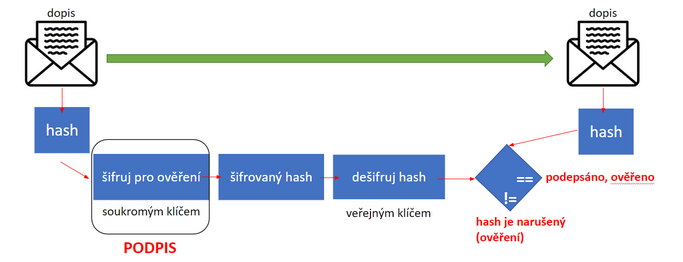
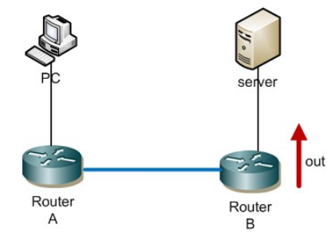
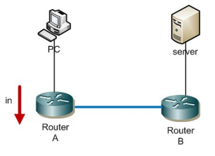

# 11 - Zabezpečení komunikace, ACL
 - Kryptografie symetrická a asymetrická, hashování, certifikáty a certifikační autorita, elektronický podpis, VPN, příklad implementace (SSL)
 - ACL standardní a rozšířený, jmenný ACL, zabezpečení přístupu k managování switche a routeru
 - Vytvoření ACL, a nasazení ACL na porty směrovače (filtrace provozu dovnitř a ven - porovnání)

## Kryptologie
 - **Kryptografie** - nauka o šifrování
 - **Kryptoanalýza** - luštění šifer
 - šifrování → snažíme se skrýt obsah zpráv
 - nejstarší šifrou je pravděpodobně **Caesarova šifra**

Šifrování musí zajistit následující druhy ochrany dat:

 1. **Důvěrnost** → pouze oprávněné strany mohou číst chráněná data
 2. **Ověření totožnosti**
 3. **Integrita** → zpráva během cesty nebyla změněna

### Symetrická šifra
 - používá **jeden klíč** (k šifrování i dešifrování)
 - rychlá a snadná implementace
 - hůře zabezpečené
 1. **Proudová šifra**
    - šifrování proudů dat
    - bit po bitu
    - **RC4** (dříve v SSL - HTTPS)
 2. **Bloková šifra**
    - šifrování pevně velkých částí dat - bloků (textové soubory)
	- **RC5**, **DES**, **AES**

### Asymetrická šifra
 - používá **dva různé klíče** - soukromý a veřejný
 - veřejný slouží k šifrování dat, soukromý k dešifrování dat
 - vztah mezi klíči je výpočetně náročný 
 - bezpečnější, hůře prolomitelná
 - **RSA**

### Elektronický podpis
 - zašifrujeme nějaký soubor **soukromým klíčem**
 - kdokoli pak může pomocí veřejného kliče ověřit, že soubor patří nám

### Hash
 - pomocí hashovací funkce získává výsledný hash (výtah, otisk)
 - použití
   - ověření integrity dat
     - když stahuju soubor, tak poznám, že ho nikdo nezměnil po cestě
	 - hash je stejný
   - ukládání hesel do databáze
     - není dobrý nápad ukládat hesla jako plain text
	 - sůl a pepř
	
#### Požadavky na hash
 - bezpečný (není reverzibilní)
 - pevná velikost
 - unikátní (různá data nevytváří stejný hash)
 - malá změna vstupních dat = velká změna na výstupu

## Digitální certifikát
 - použivá se v asymetrické kryptografii (HTTPS/VPN)
 - vytváří ho certifikační autorita
 - **certifikační autorita**
   - vydává certifikáty za poplatek
   - na základě principu přenosu důvěry je možné důvěřovat neznámým certifikátům, které jsou podepsány důvěryhodnou certifikační autoritou
 - **self-signed certifikát**
   - certifikát podepsal sám jeho tvůrce, který se tak stává CA

### Digitální podpis
 - ověřený text nebo soubor za použití certifikátu

## Využití certifikátu

### VPN
 - Virtual Private Network
 - extranet = intranet přes internet - tunelování sítě
 - šifrovaná komunikace, totožnost obou stran ověřována certifikáty

### SSL
 - Secure Sockets Layer
 - protokol poskytující zabezpečení komunikace šifrováním a autentizaci komunikujících stran
 - **TLS** - Transport Layer Security, následník SSL, v zásadě stejná funkcionalita
 - bezpečná komunikace s webovými servery pomocí **HTTPS**
 - **Využití:**
   - online obchody, které přijímají objednávky a údaje platebních karet
   - zpracování citlivých osobních údajů

## ACL
 - Access Control List
 - seznam oprávnění připojený k objektu
 - určuje, kdo nebo co má povolení přistupovat k objektu a jaké operace s ním může provádět
 - Windows → zabezpečení souborů a složek, systém se seznamem probírá postupně
 - v oblasti PC sítí
   - standardní ACL filtruje pakety na vrstvě L3
   - forma firewallu na routeru
 . lze filtrovat provoz podle jeho druhu (jen rozšířený ACL)
 - umožňuje/zakazuje přistup k síťovým službám (jen rozšířený ACL)

### Standardní ACL
 - používa čísla 1-99 a 1300 - 1999 v rozšířeném módu
 - je jednoduchý na konfiguraci
 - filtruje pouze podle zdrojové adresy a používá se jako odchozí
 - používá se pro blokování provozu blízko cíle

	

### Rozšířený ACL
 - používá čísla 100-199 a 2000-2699 v rozšířeném módu
 - dívá se na IP adresu zdroje i cíle
 - kontroluje řadu položek v hlavičce vrstvy 3 a 4
 - může blokovat provoz kdekoliv (nejlépe blízko zdroje)

	

### Jmenný ACL
 - můžeme jej použít pro standardní i rozšířený ACL
 - umožňuje upravovat či mazat jednotlivá pravidla v ACL
 - jména se lépe pamatují
 - můžeme použít "neomezený" počet pojmenovaných ACL
 - jako jméno můžeme použít i číslo, ale to musí patřit do správného rozsahu

### Nastavení
 - výchozí pravidlo, které je implicitně použito na konci ACL → deny any (zakaž všechno všem)
 1. necháme **deny any** a budeme jen povoloval přístup
 2. povolíme všechno všem (**permit any**) a budeme zakazovat
 - záleží na aktuální konfiguraci - co je výhodnější
 - ACL nastavujeme až nakonec, předmít máme ověřenou funkčnost sítě
