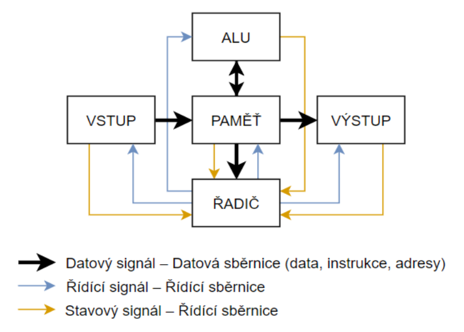
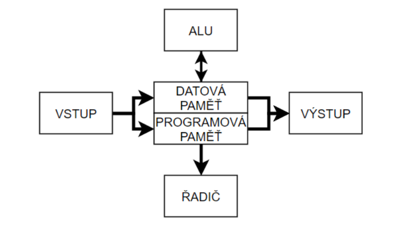

# 14 - Mikrokontroléry (mcu) - základní pojmy
 - vysvětlení pojmu mikrokontrolér
 - harvardská a von Neumannova architektura
 - hlavní vlastnosti mikrokontrolérů Atmel AVR, popis blokového schématu

## Mikrokontrolér
 - **elektronický integrovaný obvod**
 - má integrovaný **řadič**, **ALU** a **paměť**
   - **Řadič** (INSTRUCTION DECODER)
     - dekóduje intrukce
	 - ~~ovládá chod systému~~
   - **ALU**
     - aritmeticko-logická jednotka
	 - provádí operace (výpočty)
   - **Paměť**
     - dat
	 - programu
 - obsahuje **integrované periferie** z důvodu většího programátorského pohodlí
   - čítač/časovač
   - AD převodník

### Jak vzniklo MCU?
 1. Integrovaný
 2. IN/OUT nahrazeny obousměrnými (digitálními) vodiči sdruženými do **portů**
 3. Integrace **ALU** + **C** => **CPU**
 4. Integrace **CPU** + **M** => **MCU**
 5. **MCU** + integrované periferie => jednočipový mikropočítač (**SoC**)

## Architektury

 - počítače existovali, ale byli jednoúčelové

### Von Neumannova architektura
 - **Společná paměť programu a dat**
 - Architektura výpočetního systému
   - nezávislá na typu řešené úlohy
   - programuje se obsahem paměti
 - Data i instrukce jsou reprezentovány **dvojkovou soustavou**
 - Paměť je rozdělená do **buněk o stejné velikosti**, přístupných pomocí **adres**
 - Instrukce se provádí v pořadí umístění do paměti
 - Pořadí provádění instrukcí lze měnit instrukcemi podmíněného a nepodmíněného větvení

	

### Harvardská architektura
 - **Oddělená paměť programu a dat**
   - ochrana PM před chybným přepsáním
 - Paměť dat a programu mohou mít **jinou organizaci**
   - počet buněk a šířka buňky
   - RAM, Flash, EEPROM
 - **Současný přístup** do obou pamětí
   - podmínkou je samostatná instrukční a datová sběrnice

	

Příkladem harvardské architektury je **L1 cache**, která je rozdělena na instrukční a datovou paměť a má samostatnou instrukční a datovou sběrnici.

## Instruční soubory
 - CISC 
 - RISC

## Hlavní vlastnosti mikrokontrolérů Atmel AVR
 - 8 bitová **harvardská RISC architektura**
 - jedna z prvních rodin MCU, která použila **flash paměť** jako PM
 - **PM** → Flash (paměť programu)
 - **DM** → EEPROM (trvalá paměť dat)
 - **Cache** → SRAM  (paměť dat)

### Příznakový registr
 - status register
 - obsahuje informace o výsledku aritmetických operací

#### Příznaky
 - **I** - globální povolení přerušení
 - **T** - jednobitová paměť
 - **HC** - příznak polovičního přenosu (BCD kód)
 - **S** - (N xor V) - příznak znaménka
 - **V** - aritmetické přetečení
 - **N** - záporný výsledek
 - **Z** - nulový výsledek
 - **C** - přenos do vyššího řádu
   
## Popis blokového schématu 

