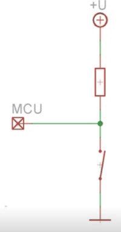
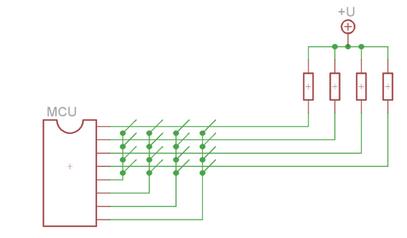
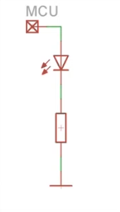
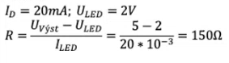

# 15 - Připojování externích periferií k mcu
 - Tlačítka, klávesnice, LED, segmentové a inteligentní displeje

## Dokumentace k dispozici
 - Schéma portu
 - Elektrické charakteristiky

## Základy
 - chceme připojit nějakou periferii
   - v prvním kroku zjistit, jaké jsou na pinu hodnoty napětí a proudu
 - u ATMega64 máme buď 3V nebo 5V
   - můžeme pin zatěžovat proudem 10 mA při 3V a 20 mA při 5V
 - neměl by se překročit proud 40 mA (na jednom portu) a 400 mA (součtově na všech portech)

### Externí součástka
 - fyzické místo
 - napájení
 - cena
 - poruchovost

## Tlačítka

### Základní zapojení

 - Nejjednodušší připojení tlačítka k pinu MCU
 - Rezistor zde funguje jako externí **pull-up odpor**
   - definuje logické úrovně napětí
   - omezuje proud, který teče ze zdroje do země, když je tlačítko stisknuté
 - **Výhody**
   - jednoduché zapojení
   - každé tlačítko má vlastní vstup → lze více současně
 - **Nevýhody**
   - obsazenost I/O pinů

### Multiplexor
 - **Výhody**
   - počet tlačítek = 2(počet pinů - 1)
   - lze více současně
 - **Nevýhody**
   - obsazenost I/O pinů

### Maticové zapojení
 - možné zapojení **PC klávesnice**
 - **Výhody**
   - počet tlačítek = 2(počet pinů / 2)
 - **Nevýhody**
   - více jak 2 tlačítka současně nemusí přečíst správně
   - mohou se tam objevit tzv. trojúhelníky
     - dají se odfiltrovat pomocí diod

## LED dioda

### Základní zapojení
 - **Výhody**
   - jednoduché zapojení
 - **Nevýhody**
   - obsazenost I/O pinů
   - proudové zatížení

#### Jak spočítáme velikost odporu?

### Tranzistor
 - do výpočtu velikosti odporu se musí započítat úbytek napětí na tranzistoru
 - **Výhody**
   - nenapájíme LED přímo z MCU
   - LEDka nezatěžuje ten pin 
   - pin budeme zatěžovat jenom spínacím proudem

## Segmentové displeje

### Základní zapojení
 - **Výhody**
   - jednoduché
   - SW dekodér
 - **Nevýhody**
   - velké proudové zatížení
   - velká obsazenost I/O pinů

### Zapojení s shift registrem
 - **Výhody**
   - konstantní počet I/O pinů (2)
 - **Nevýhody**
   - sériový zápis do všech segmentů

## Inteligentní displeje
 - nekomunikujeme s displejem, ale s jeho **řadičem**
 - řadič rozhoduje jestli bude displej grafický nebo alfanumerický
 - připojují se buď **paralelně** nebo přes **I2C**
 - **alfanumerické**
   - umožňují zobrazovat jen písmena a číslice
   - (instrukce rotace probíhá v rámci jednoho řádku)
 - **grafické**
   - adresujeme přímo jednotlivé body (pixely)
   - **monochromatické** (na každý pixel 1 bit)
   - **barevné** (kolik mám bitů tolik mám barevných odstínů)
   - můžeme na nich vytvářet různé obrazce ...
 
