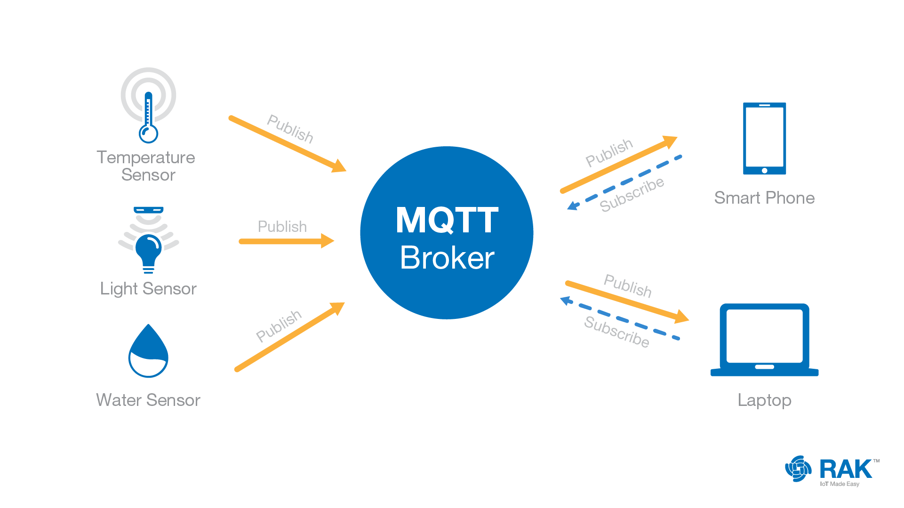

# 17 - Internet věcí
 - Vysvětlení pojmu, architektura, sítě typu LPWAN, komunikační protokoly

## Internet věcí
 
= 

 - **Spotřebitelský** (Consumer - CIoT) - chytré domácnosti
 - **Průmyslový** (Industrial - IIoT) - sledování zásilky

 

 - základem celého IoT jsou **DATA**
 - **data** jsou nějaké nezpracované hodnoty (1234)
 - **informace** = známe jejich význam (heslo: 1234)
 - **znalost** = informace + kontext (Frantovo heslo: 1234)

## Rozsah

### WPAN
 - Wireless Personal Area Network
 - IEEE 802.15
 - Bluetooth, BLE (Bluetooth Low Energy)

### WLAN
 - Wireless Local Area Network
 - IEEE 802.11
 - ZigBee, Z-Wave

### LPWAN
 - Low Power Wide Area Network

## Architektura

### Základní bloky IoT
 - **Hardware** - senzory
 - **Middleware** - síť (získávání, uložení a prezentace dat)
 - **Software** - analýza

## LPWAN
 - Low Power WAN
 - celoplošné sítě s malou energetickou náročností
 - dosah v desítkách kilometrů
 - **přenos na dlouhé vzdálenosti**
 - ohled na **bateriová zařízení**
 - než přišly LPWAN sítě, používali se hlavně 2G sítě (IoT)
 - pracují na frekvenci **800-900 MHz**
   - nízká frekvence = nízká energetická náročnost, lepší dosah
   - snadněji se dostane skrze překážky

## Komunikační protokoly LPWAN

### NB-IoT
 - NarrowBand (malý bandwidth)
 - uživatel není provozovatelem, pronajímá si "infraskturkturu"
 - 02, Vodafone, T-Mobile
   - **mobilní operátoři**
 - nejnovější
 - **náročnější na spotřebu**
 - nejvyšší rychlost - **127 kb/s**
 - velikost zprávy - může být větší než 1 kb
 - zařízení musí obsahovat **SIM kartu**

### LoRaWAN
 - Long Range WAN
 - Neziskovka LoRa alliance
 - **Obousměrná komunikace**
 - Bezlicenční pásma 868 MHz
 - dosah
   - 20 km volná krajina
   - 2-5 km ve městě

### Sigfox
 - Omezený počet zpráv za den - 144
 - Malá velikost zprávy - 12 bytů
 - **Jednosměrná komunikace**
 - dosah
   - 50 km volná krajina
   - 3-5 km ve městě
 - úspornější než LoRa

## MQTT
 - Message Queuing Telemetry Transport
 - komunikační protokol
 - Otevřený protokol pro **Industrial IoT**
 - Většinou používá TCP
 - Návrhový vzor publisher subscriber

 1. **Publisher publikuje** zprávu do konkrétního tématu (topic)
 2. **Broker přijme** zprávu od publishera a uchovává ji
 3. **Broker posíla** zprávu všem odběratelům (subscriber), kteří se přihlásili k odběru zpráv z tohoto tématu
 4. **Subscriber přijme** zprávu od MQTT brokera a může s ní pracovat dle svých potřeb

	

 - jedno zařízení může najednou být v některých tématech publisher a v jiných subscriber
 - jeden centrální bod se stará o výměnu zpráv - MQTT Broker
