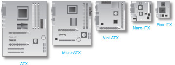

# 22 - Základní desky
 - Základní deska (čipová sada, bios)
 - interní sběrnice (PCI, PCIe)
 - externí sběrnice (usb, firewire)

## Základní deska
 - hlavní část počítače
 - propojuje komponenty, dává jim napájení

### Formáty základních desek
 - nejčastější je formát ATX
 - dále jsou kompaktnější varianty

## Části MB
 - CPU Soket
 - Čipset (severní, jižní)
 - Interní sběrnice
   - PCI
   - PCI express
   - SATA
 - Externí sběrnice
   - PS/2
   - USB
   - Thunderbolt
   - Firewire
 - BIOS/UEFI

### Čipset
 - **Northbridge**
   - Má na starosti rychlejší periferie
   - Dnes většinou součástí CPU (integrovaný)
   - RAM
   - Sběrnice PCIe
 - **Southbridge**
   - má na starosti pomalejší periferie
   - s CPU komunikuje přes Northbridge
   - LPC sběrnice
     - ROM paměť s BIOSem
	 - Super I/O
   - Sběrnice PCI
   - Sběrnice SATA, RAID, USB, Ethernet

### BIOS
 - Basic Input Output System
 - uložen v paměti (EEPROM) přímo na základní desce
