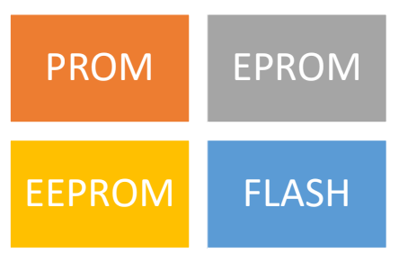
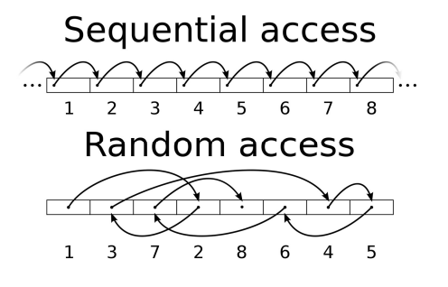

# 23 - Paměti
 - Typy pamětí, struktura, základní parametry, optimalizace přístupu do paměti (cache)

## Paměti
 - **volatilní**
   - po ztrátě napájení jsou data ztracena
   - rychlejší, ale dočasné
   - RAM
 - **nevolatilní**
   - data jsou zachována i po ztrátě napájení
   - ROM

### ROM
 - Read-Only Memory
 - **nevolatilní**
 - obsah je **dán při výrobě**, poté již nelze měnit
 - používaly se k uložení BIOSu nebo na rozšiřujících kartách
 - **kombinační obvod**
 - dnes ojedinělé

### PROM
 - Programmable ROM
 - též **OTP** (One Time Programmable)
 - jsou programovatelné pouze jednou
 - každý bit je při programování možné přepsat z 1 na hodnotu 0, avšak tato změna je nevratná
 - lze programovat po částech
 - kapacita v řádech kB

### EPROM
 - Erasable PROM
 - **opakovaný zápis dat**
 - mazání pomocí **ultrafialového světla**
 - průsvitné okénko z křemičitého skla
 - **zápis** - 10 až 20 minut
 - **mazání** - 30 minut
 - **použití** - uložení firmware

### EEPROM
 - Electrically Erasable PROM
 - mazání a programování se provádí elektricky
   - trvá méně než minutu
 - tranzistory MNOS
 - \+ životnost 200 tisíc zápisů
 - \- vyšší složitost buňky, nižší hustota a vyšší cena než flash
 - **použití** - uložení BIOSu

### Flash
 - **elektricky programovatelná**
   - jednotky sekund
 - vnitřně organizována po blocích
 - \+ každý blok lze programovat samostatně (na rozdíl od EEPROM), ostatní jsou zachovány
 - \- nižší životnost než EEPROM, \+ levnější
 - **použití** - základ paměťových médií (SD, USB, SSD, ...)
 - **NVRAM** - EEPROM / Flash

#### NOR flash
 - čte se po **slovech** (RAM)
 - **operační paměť**
 - malá kapacita
 - rychlost zápisu < rychlost čtení
 - umožňuje **XIP**

#### NAND flash
 - čte se po **blocích**
 - pro **ukládání** souborů (SSD)
 - velká kapacita
 - rychlost zápisu > rychlost čtení
 - neumožňuje **XIP**

### RAM
 - Random Access Memory
 - paměť s libovolným přístupem
 - **volatilní**
 - umožňuje čtení i zápis na libovolné pozici v paměti
 - prakticky **neomezený počet přepisů**
 - přístup ke všem buňkám trvá stejnou dobu
 - **sekvenční obvod**
 - používá se jako **operační paměť**

#### DRAM
 - Dynamic RAM
 - data se uchovávají pomocí vybíjených kondenzátorů
 - \+ levnější
 - \- větší spotřeba
 - Moduly
   - **SIMM**
   - **DIMM**
 - **DDR** (Double Data Rate)
   - přenáší data na nástupnou i sestupnou hranu 
 - verze DDR nejsou zpětně kompatibilní (DDR2, DDR3, ...)

#### SRAM
 - Static RAM
 - data se uchovávají pomocí klopných obvodů
 - \+ menší spotřeba, rychlejší
 - \- dražší
 - **použití** - CPU cache, HDD buffer

### Sekvenční vs náhodný přístup

	

### CAM
 - Content-Addressable Memory
 - paměť adresovatelná obsahem
 - vyhledávání na základě shody klíčů, paměť obsahuje komparátory
 - **použití** - cisco switch (tabulka MAC adres)
 - \+ vysoká rychlost reakce
 - \- vysoká pořizovací cena

### Cache
 - urychluje přístup k často používaným datům
 - **softwarová / hardwarová**

## Důležité parametry
 - **kapacita** (GB)
 - **rychlost** (GB/s)
 - **frekvence** (MHz) - počet instrukcí za sekundu
 - **napětí**
 - **organizace** - počet adres x počet dat na adrese
 - **druh přístupu** - sekvenční/přímý
