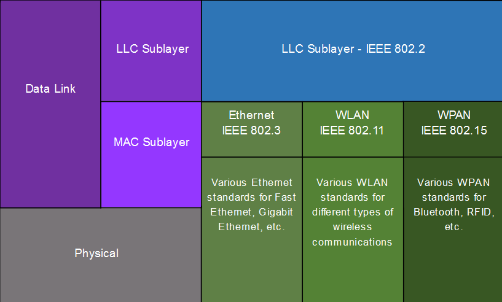

# 1 - Vrstva síťového přístupu, Ethernet
 - Protokol IEEE 802.3, MAC vrstva, IEEE 802.2, LLC vrstva, unicast, broadcast, multicast, anycast, ARP protokol, popis rámce Ethernet, PPP Média, modulace, šířka pásma, propustnost
 - Druhy médií - kabely, optická vlákna, bezdrátové sítě - základní principy činnosti
 - Značení kabelů a konektroů, kategorie kabelů, zapojení konektorů
 - Optická vlákna a konektory (SMF/MMF), základní princip činnosti

## 1. Vrstva síťového přístupu TCP/IP

V modelu OSI/ISO se dělí následovně

	

 - Spojová
   - LLC podvrstva
   - MAC podvrstva
 - Fyzická

Spojová a fyzická dohromady tvoří vrstvu síťového přístupu

### 1.1 Spojová vrstva

#### 1.1.1 Logical Link Control (LLC)
 - přidává do rámce informaci o network layer protokolu

#### 1.1.2 Media Access Control (MAC)
 - je odpovědná za enkapsulaci dat a media access control
 - přidává zdrojovou a cílovou MAC adresu do rámce
 - přidává trailer do rámce (pro detekci chyb)
