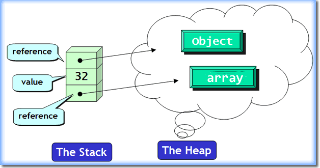

# 1 - Základní programové konstrukce

 - Proměnná
 - Datový typ
 - Reference
 - Hodnota
 - Program
 - Podprogram
 - Podmínky
 - Cykly
 - Operátory

## 1. Proměnná
 - Proměnná je **symbolické jméno** pro nějakou informaci, která je uchovaná v paměti (RAM) při běhu programu
 - Pomocí tohoto **symbolického jména** se můžeme na informaci ve svém kódu **odkazovat** nebo ji **měnit**
 - Proměnnou deklarujeme specifikováním **datového typu** a názvu proměnné
 ```C
    int cislo; // Deklarace proměnné
    cislo = 5; // Inicializace proměnné
 ```
 - Oba dva tyto kroky se dají napsat do jednoho řádku:
 ```C
    int cislo = 5; // Deklarace + Inicializace
 ```
### 1.1 Alokace paměti
 - Proměnnou můžeme přidat na vrchol **zásobníku** (stack)
 - V takovém případě je paměť automaticky uvolněna, po skončení **scopu** (blok kódu, kde je proměnná validní), ve kterém byla deklarována. (Mluvíme o lokální proměnné)
 - **Scope** nám pomáhá předejít kolizím jmen u proměnných
 - Proměnné s neznámou velikostí při běhu programu se ukládají na **haldu** (heap)
 - Proměnná poté představuje **referenci** na místo v paměti, kde je uložená její hodnota
   - týká se to např. datového typu **string** (což je vlastne pole znaků)
   - pole je ve skutečnosti ukazatel na první prvek v daném poli
 - Rozdíl mezi zásobníkem a haldou je, že na haldu se musí paměť dynamicky alokovat a dealokovat

 <div align="center">
 	
 </div>

## 2. Datový typ
 - U proměnných musíme definovat tzv. datové typy 
   - pokud tedy nejsme v dynamicky typovaném programovacím jazyce jako je např. Python
 - Datový typ určuje hodnoty nebo rozsah hodnot, kterých může nabývat proměnná (nebo konstanta)
 - Pro datové typy poté interpret nebo kompilátor provádí tzv. **typové kontroly**
   - zkontroluje např. jestli provádíte s typem povolenou operaci
   - příklad nepovolené operace může být inkrementace proměnné datového typu bool
   - **pokud se chceme typovým kontrolám vyhnout** - tak v jazyce C existuje pro to speciální datový typ **void**
### 2.1 Druhy datových typů
 1. Jednoduché datové typy
    - jednoduché (elemenární) datové typy jsou většinou přímo **zabudovány do jazyka**
    - jejich **skládáním** pak mohou vznikat **složitější typy**

## 3. Reference
 - Reference umožňuje nepřímý přístup k určitým datům
 - Přístup k datům, na které reference odkazuje nazýváme **dereferencí**
 - Reference je uvnitř vlastně ukazatel, ale pro nás se bude chovat jako normální proměnná
   - reference před námi vlastně schová veškerou funkcionalitu ukazatelů
 - Reference nám tedy umožnuje přístup k nějaké proměnné pod jiným identifikátorem
 - Typicky nebudeme vytvářet referenci pro jednoduché datové typy jako je integer, ale pro typy složené, které jsou uloženy na haldě (třídy, pole)
 - Pokud budeme tedy pole předávat do nějaké funkce, tak je efektivnější ho předat jako referenci, než znovu jeho obsah kopírovat
