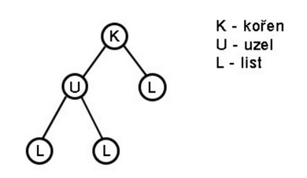
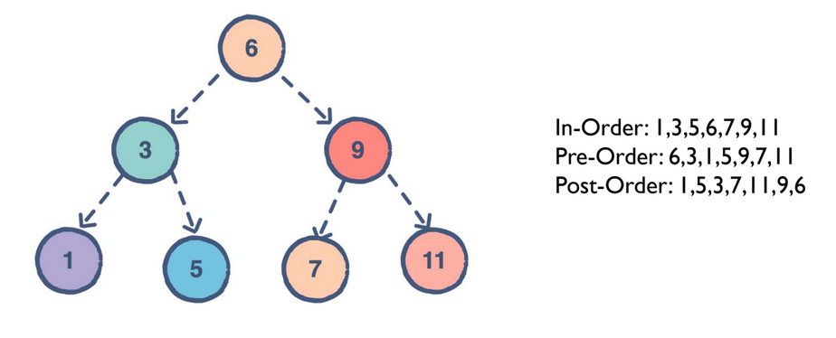

# 4 - Spojové struktury
 
  - spojové struktury, seznamy, stromy

## Spojové struktury
 - Prvky nejsou za sebou v paměti
 - Obsahují **odkaz** na následující prvek
 - Mají **kořen** (počáteční prvek)

### Spojový seznam
 - linked list
 - jednosměrný seznam
 - prvky odkazují na následující prvek

<div align="center">
	
</div>

```C#
class LinkedList<T>
{
    Node? head;

    public void insert();
    public override ToString();
    // ...

    class Node
    {
        public T value;
        public Node? next;

        public Node(T val, Node? n)
        {
            value = val;
            next = n;
        }
    }
}
```

#### Variace spojového seznamu
 - **Dvojitý spojový seznam**
   - má odkaz jak na následující, tak i předchozí prvek

<div align="center">
	
</div>

 - **Kruhový spojový seznam**
   - poslední prvek odkazuje na první

<div align="center">
	
</div>

### Stromy
 - Větvené struktury
 - Obsahují kořen, uzle a listy

<div align="center">
	
</div>

#### Procházení stromu

 - binární vyhledávací strom
   - leftChild < parent < rightChild

<div align="center">
	
</div>

## Graf
 - nejobecnější spojová struktura
 - je složená z **vrcholů** (V) a **hran** (E)
 - každý vrchol může mít libovolný počet sousedních uzlů
 - hrany můžou být **ohodnocené**
   - dijkstrův algoritmus
 - hrany také můžou mít **směr**
 - **reprezentace grafu**
   - adjacency matrix
     - pokud n je počet vrcholů
	 - budeme mit n*n matrix
	 - hodnoty v matrixu budou 0 nebo 1 podle toho, jestli spolu hrany sousedí nebo ne
   - adjacency list
     - pole liked listů
	 - každý linked list obsahuje sousední vrcholy daného vrcholu
