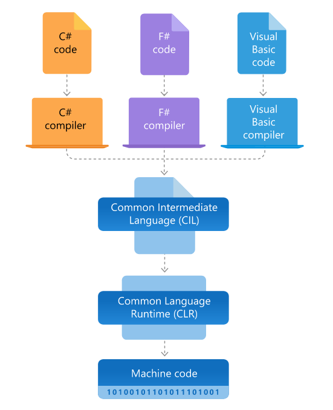

# 11 - Architektury .NET
 - Prostředky architektury .NET pro cílové platformy, MVVM, Binding, Observer, událostmi řízené programování

## .NET
 - open-source **vývojářská platforma** od společnosti **Microsoft**
 - slouží pro vytváření různých aplikací
   - web
   - mobile
   - desktop
   - IoT
 - **.NET Core** - běží kdekoli - Windows, Linux, MacOS
 - **.NET Framework** - jen pro Windows (webové stránky a další služby)
   - ASP .NET

	

### CLR
 - Common Language Runtime
 - společné virtuální prostředí, kde běží aplikace
 - stará se o
   - správu paměti (garbage collector)
   - zpracování výjimek
   - vlákna
   - bezpečnost aplikace

### FCL
 - Framework Class Library
 - soubor knihoven integrovaný do CLR
 - `System` namespace
   - datové typy
   - datové struktury - `Array`, `List<T>`

### Podporované jazyky
 - C#
 - F#
 - Visual Basic

## MVVM
 - Model-View-ViewModel
 
### Model
 - obsahuje logiku aplikace a data

### View
 - obsahuje uživatelské rozhraní
 - zobrazuje data
 - zprostředkovává komunikaci s uživatelem

### ViewModel
 - spojuje Model a View
 - ovládací prvky z View jsou pomocí bindingu propojeny s ViewModelem, kde zjišťují svůj obsah
   - interface `INotifyPropertyChanged` - upozorní v případě změny

### Binding
 - svazuje datové zdroje s ovládacími prvky
 - nejčastěji vlastnosti ViewModelu svázány s ovládacími prvky z View

### Observer
 - pozorovatel
 - čeká na změnu objektu, poté může reagovat určitým způsobem

## Event-driven programming
 - událostmi řízené programování
 - chod programu je řízen pouze událostmi
   - uživatelská akce / změna hodnoty na serveru
 - polling vs interrupt
