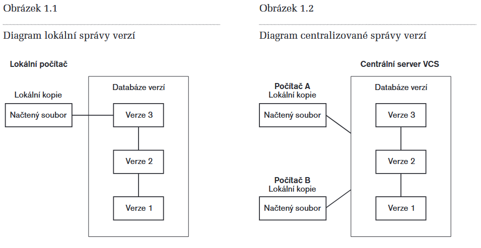
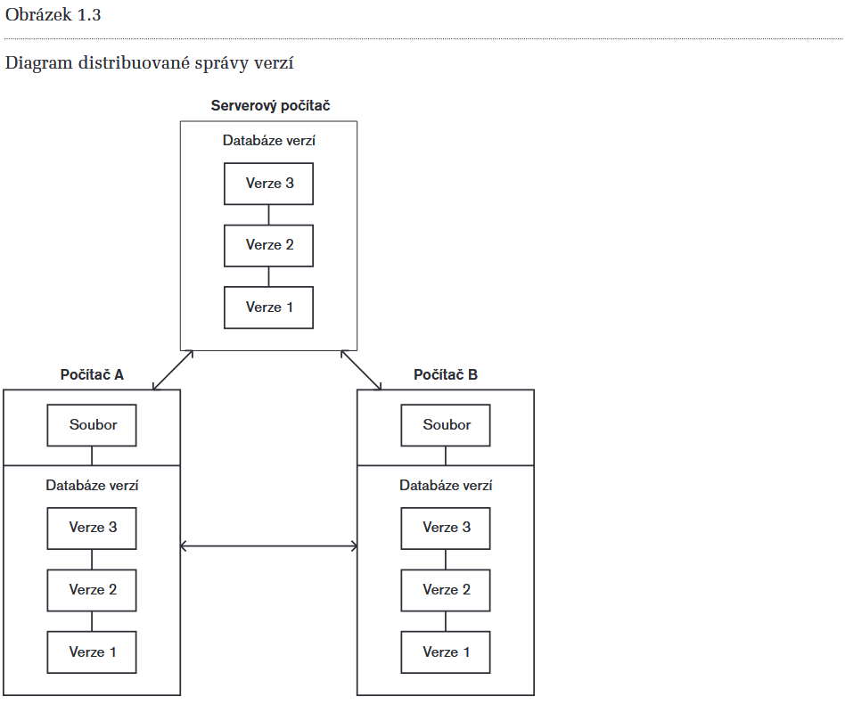

# 12 - Verzovací systémy

## 1. Správa verzí

 - Systém, který zaznamenává změny souboru nebo sady souborů v průbéhu času, a uživatel tak může kdykoli obnovit jeho/jejich konkrétní verzi
 - VCS = Version Control System
 - Umožňuje vrátit jednotlivé soubory nebo celý projekt do předchozího stavu, porovnávat změny provedené v průběhu času a mnoho dalšího
 - Pokud používáte verzovací systém, většinou také snadno obnovíte soubory, které jste ztratili nebo v nichž byly provedeny nežádoucí změny

## 2. Systémy správy verzí

### 2.1 Lokální (Obr 1.1)
 - Lokální jednoduchá databáze, která uchovává všechny změny souborů s nastavenou správnou revizí
 - Jedním z velmi oblíbených nástrojů byl systém s názvem **rcs**

### 2.2 Centralizované (Obr 1.2)
 - Důvod vzniku => potřeba spolupráce s dalšími pracovníky týmu
 - CVCS = Centralized Version Control System
 - Příkladem takového systému může být: CVS, Subversion nebo Perforce
 - Tyto systémy obsahují serverovou část, která uchovává všechny verzované soubory
 - Z tohoto centrálního úložiště si potom soubory stahují jednotliví klienti
 - Lepší než lokální VCS, ale pokud spadne server, nebude možné pracovat
 - Když se něco porouchá a nebyla provedena záloha serveru, dojde ke ztrátě všech dat

    

### 2.3 Distribuované (Obr 1.3)
 - DVCS = Distributed Version Control System
 - Řeší problémy zmiňované u centralizovaných VCS
 - Jsou to např. systémy: **Git**, Mercurial, Bazaar nebo Darcs
 - V těchto systémech uživatelé nestahují pouze nejnovější verzi souborů, ale uchovávají kompletní kopii repozitáře
 - Každá z těchto **lokálních kopií** je tak plnohodnotnou **zálohou** všech dat
 - Mnoho z těchto systémů dokáže navíc pracovat s **několika vzdálenými repozitáři** najednou
   - V rámci jednoho projektu tak můžete spolupracovat s **různými skupinami lidí**
   - Také si můžete vytvořit **několik pracovních postupů**, což v centralizovaných systémech není možné

    

## 3. Systém Git

### 3.1 Snímky (Obr 1.5)
 - Hlavním rozdílem mezi Gitem a ostatními systémy je to, jak Git zpracovává data
 - Většina systémů ukládá informace jako seznamy změn jednotlivých souborů (Obr 1.4)
 - Takže mají uloženou sadu souborů a seznam změn těchto souborů v čase
 - Když v systému **Git** zapíšete stav projektu:
   - Git v podstatě "vyfotí" (**snapshot**), jak vypadají všechny vaše soubory v daném okamžiku a **uloží reference** na tento snímek
   - Pokud v souborech nebyly provedeny žádné změny, Git uloží pouze odkaz na předchozí identický soubor

### 3.2 Práce s Gitem
 - Díky tomu, že máte uloženou lokální databázi na svém počítači, probíhá většina operací takřka okamžitě
 - Git tak může provádět všechny výpočty lokálně
 - Neprobíhá tedy skoro žádná komunikace se serverem
 - To také znamená, že můžete v klidu na svém projektu pracovat offline a zapisovat nové revize, které se načtou ve chvíli, kdy se opět připojíte k síti
 - Jakmile jednou zapíšete snímek do systému Git, je téměř nemožné ho ztratit
   - Můžete tak experimentovat s vědomím, že neriskujete zničení své práce

### 3.3 Kontrolní součet
 - Než je v Gitu cokoli uloženo je proveden kontrolní součet (**SHA-1**)
 - Není tedy možné změnit obsah jakéhokoli souboru nebo adresáře aniž by o tom Git věděl
 - **SHA-1** je hashovací algoritmus, který vygeneruje 40 hexadecimálních číslic
   - výsledek může vypadat takto: **24b9da6552252987aa493b52f8696cd6d3b00373**
 - Git v databázi neukládá soubory podle názvu, ale podle otisku (hashe) jejich obsahu

### 3.4 Tři stavy
 - Git pro spravované soubory používá tři základní stavy:
   - Zapsáno (commited)
   - Změněno (modified)
   - Připraveno k zapsání (staged)
 - Standartní postup v systému Git:
    1. změníte soubory ve svém pracovním adresáři
    2. Soubory připravíte k uložení tak, že vložíte snímky do oblasti připravených změn
    3. Zapíšete revizi. Připravené snímky souborů se tak natrvalo uloží do adresáře Git

### 3.5 Repozitář
 - Repozitář je definován jako složka .git/ uvnitř vašeho projektu
 - Když odstraníte složku .git/, tak se smaže všechna historie vašeho projektu

### 3.6 Commit
 - Commit je **snapshot** neboli snímek, který zachycuje, jak vypadaly soubory v danou chvíli ve vašem projektu

### 3.7 Větvení
 - Větvení znamená, že se můžete odloučit od hlavní linie vývoje a pokračovat v práci, aniž byste tuto hlavní linii zanášeli
 - U jiných VCS se může jednat o náročný proces, který často vyžaduje vytvoření nové kopie adresáře projektu
   - To může u velkých projektů trvat poměrně dlouho
