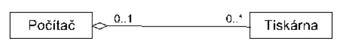

# 13 - Konceptuální návrh databáze
 - Proces navrhování databáze
 - Cílem je vytvořit model databáze, který bude popisovat všechny objekty a vztahy mezi nimi
 - Nejedná se tedy o popis dat přímo v počítači
 - Je nutné, aby mu rozuměl i zadavatel (neprogramátor)

## 1. Prvky konceptuálního návrhu
 1. **Entitní typ**
    - specifikuje jaké typy objektů budou v databázi uchovávány
	- např. třída, žák
 2. **Atributy**
    - charakterizují jednotlivé entitní typy
	- např. žák - jméno, příjmení, datum narození, třída
 3. **Vztahy (relace)**
    - propojení mezi entitami, které popisují jakým způsobem jsou data v databázi spojena
	- např. třída má *n* žáků -> vztah mezi třídou a žáky

## 2. Relace mezi entitami
 - **Stupeň vztahu**
   - Unární - relace je spojena sama se sebou
   - Binární - vztah mezi dvěma relacemi
   - Ternární - vztah mezi třemi relacemi najednou
   - *N*-ární - vztah mezi *n* relacemi zároveň
 - **Kardinalita**
   - vyjadřuje, kolik entit daného typu se na relaci podílí/může podílet
     - 1:1, 1:N, N:M
   - např. učitel vyučuje více studentů
 - **Parcialita**
   - vyjadřuje povinnost účasti v relaci
     - 0 - nemandatorní relace
	 - 1 - mandatorní relace
   - např. učitel NEMUSÍ vyučovat žádné studenty, ale student MUSÍ být vyučován učitelem

## 3. Relace závislostí mezi entitami
### 3.1 Agregace
 - část může existovat bez celku
 - celek není unikátní pro všechny části
 - např. počítač a tiskárna
   - počítač s tiskárnou tvoří jeden celek, ale tiskárna může existovat i bez počítače

 
	

### 3.2 Kompozice
 - část nemůže existovat bez celku
 - je jen mezi silnou a slabou entitou
 - např. nákup a položka v seznamu
   - položka nákupu nemůže existovat bez vazby na nákupní seznam

	

#### 3.2.1 Silná entita
   - lze ji popsat jen pomocí jejich atributů
   - může existovat i bez vazby se slabou entitou

#### 3.2.2 Slabá entita
   - má povinnou účast ve vazbě
   - nemůže existovat bez vazby se silnou entitou
   - klíč nelze vytvořit bez atributů jiné entity (cizích klíčů)

## 4. Rozdíl mezi konceptuálním a logickým modelem databáze
 - Důležité je vědět rozdíl mezi konceptuálním a logickým modelem
 - Je to také jedna z věcí, na kterou se dá poukázat při zkoušení

### 4.1 Konceptuální databázový model
 - Vysoká úroveň reprezentace dat a jejich vztahů
 - Abstraktní a ignoruje implementační detaily
 - Soustředí se na to, co jsou potřebná data a jak by měla být organizována

### 4.2 Logický databázový model
 - Převádí konceptuální model na konkrétnější a technickou reprezentaci
 - Zahrnuje implementační detaily, jako jsou datové typy a omezení
 - Soustředí se na to, jak budou data uložena a přístupná prostřednictvím systému správy databáze

Konceptuální model tak např. vyjadřuje vazbu **N:M** jako jednu čáru mezi dvěma tabulkami. Oproti tomu logický model už obsahuje i vazební tabulku.

Dalším příkladem by mohlo být použití primárních a cizích klíčů, které také patří až do logického modelu. V konceptuálním modelu stačí reprezentace vazby jako popsaná čára spojující dvě tabulky.
