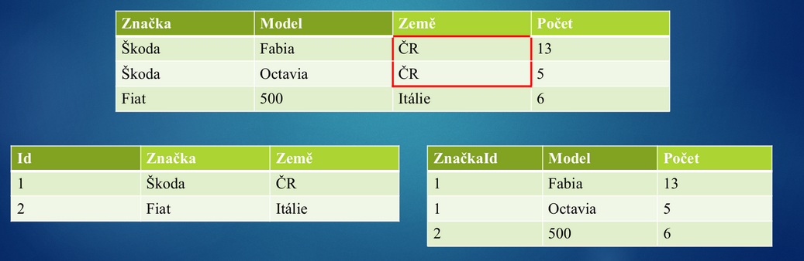
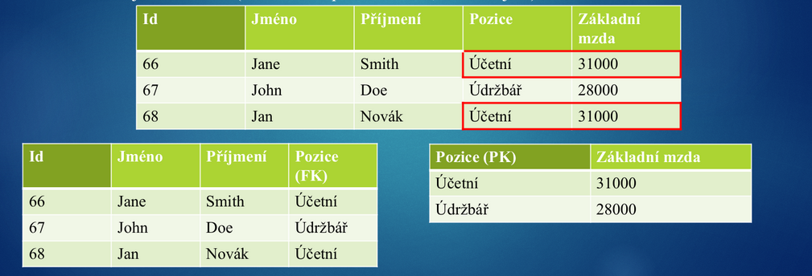
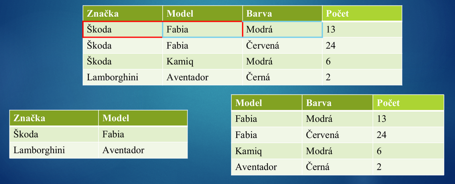

# 14 - Normalizace databáze
 - Způsob, jak navrhnout ideální databázi
 - Snaží se přeorganizovat data tak, aby využívala výhod relačních databází
 - V čím vyšší je tabulka normální formě, tím kvalitněji je tabulka navržena
   - menší šance porušení integrity dat
 - Proces, při kterém se relace rozkládají za účelem:
   - Jednodušší práce s daty
   - Lepší manipulace s daty
   - Zabránění opakování dat
   - Lepší konzistence dat
 - Ideální je dostat databázi do 2.NF, není potřeba vyšší norem

## Způsoby uložení dat

### OLAP
 - Online Analytical Processing
 - Uspořádává velké objemy dat tak, aby byla data přístupná a srozumitelná všem uživatelům

### OLTP
 - Online Transaction Processing
 - Nejsnazší a nejbezpečnější modifikace dat
 - Používá se ve většině databázových aplikací

Obecně OLAP je optimalizován na ukládání velkého množství dat a na realizaci složitých dotazů. Oproti tomu OLTP je vhodnější pro zpracování velkého množství menších transakcí.

## Normální formy (NF)

### 0. Normální forma
 - Databáze je v 0. NF tehdy, když alespoň jeden atribut obsahuje více hodnot

### 1. Normální forma
 - Databáze je v 1. NF tehdy, když atributy nelze dále dělit, a jsou tudíž atomické

<table>
	<thead>
		<tr>
			<th>Id</th>
			<th>Jméno</th>
			<th>Telefon</th>
		</tr>
	</thead>
	<tbody>
		<tr>	
			<td>1</td>
			<td>Jan Novák</td>
			<td>487 876 453</td>
		</tr>
		<tr>	
			<td>2</td>
			<td>John Doe</td>
			<td>734 434 289, 777 888 333</td>
		</tr>
	</tbody>
</table>

Po úpravě → dvě tabulky

<table>
	<thead>
		<tr>
			<th>Id</th>
			<th>Jméno</th>
			<th>Příjmení</th>
		</tr>
	</thead>
	<tbody>
		<tr>	
			<td>1</td>
			<td>Jan</td>
			<td>Novák</td>
		</tr>
		<tr>	
			<td>2</td>
			<td>John</td>
			<td>Doe</td>
		</tr>
	</tbody>
</table>

<table>
	<thead>
		<tr>
			<th>PK</th>
			<th>FK</th>
			<th>Telefon</th>
		</tr>
	</thead>
	<tbody>
		<tr>	
			<td>1</td>
			<td>1</td>
			<td>487 876 453</td>
		</tr>
		<tr>	
			<td>2</td>
			<td>2</td>
			<td>734 434 289</td>
		</tr>
		<tr>	
			<td>3</td>
			<td>2</td>
			<td>777 888 333</td>
		</tr>
	</tbody>
</table>

### 2. Normální forma
 - Databáze je v 2. NF když je v 1. NF a všechny neklíčové atributy závisí na celém složeném klíči (ne jen na jeho části)

	

### 3. Normální forma
 - Databáze je ve 3. NF, pokud je v 2. NF, a všechy neklíčové atributy jsou navzájem nezávislé (jsou závislé pouze na klíči ne navzájem)

	

### Boyceho-Coddova normální forma
 - Atributy, které jsou součástí primárního klíče musí být navzájem nezávislé

	

